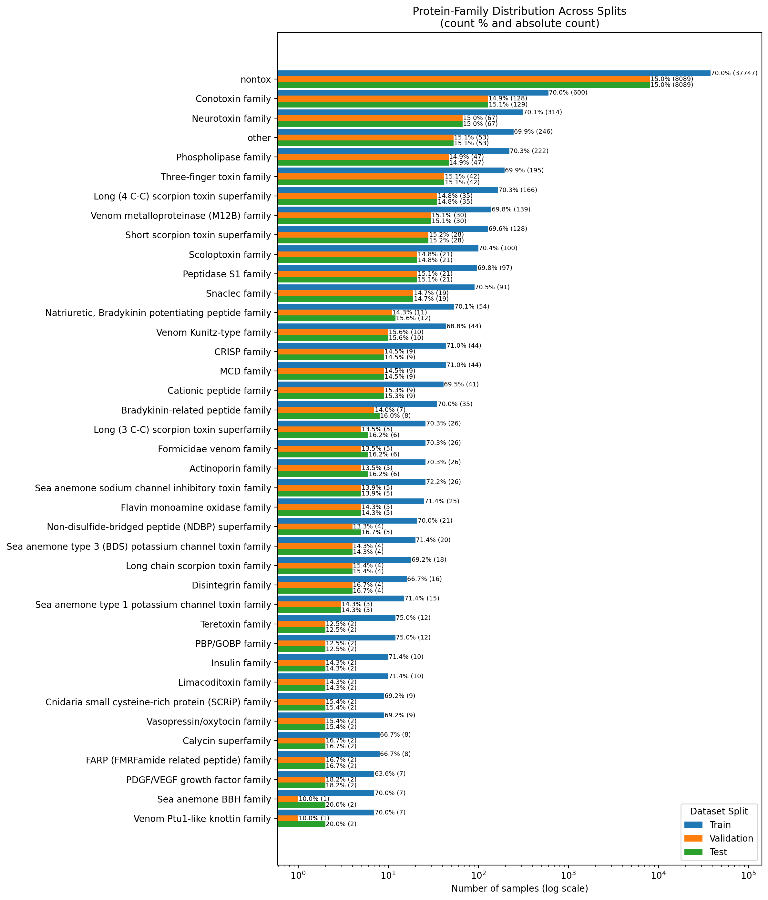

```python
import os, re
import pandas as pd
import numpy as np
from Bio import SeqIO
from collections import defaultdict

from sklearn.preprocessing import MultiLabelBinarizer
from iterstrat.ml_stratifiers import MultilabelStratifiedShuffleSplit

import matplotlib.pyplot as plt

from pymmseqs.commands import easy_cluster
```

# Toxins
(taxonomy_id:33208) AND (reviewed:true) AND (keyword:KW-0800)


```python
tox = pd.read_csv('../data/raw/0800.tsv', sep='\t')
tox = tox.dropna(subset=["Protein families"])

tox.rename(columns={"Entry": 'identifier'}, inplace=True)
n_fams = tox["Protein families"].nunique()
print(f"Number of distinct protein families: {n_fams}")
tox
```

    Number of distinct protein families: 593


<div>
<style scoped>
    .dataframe tbody tr th:only-of-type {
        vertical-align: middle;
    }

    .dataframe tbody tr th {
        vertical-align: top;
    }

    .dataframe thead th {
        text-align: right;
    }
</style>
<table border="1" class="dataframe">
  <thead>
    <tr style="text-align: right;">
      <th></th>
      <th>identifier</th>
      <th>Protein names</th>
      <th>Protein families</th>
      <th>Sequence</th>
      <th>Organism</th>
      <th>InterPro</th>
      <th>Pfam</th>
      <th>Tissue specificity</th>
      <th>Signal peptide</th>
      <th>Fragment</th>
    </tr>
  </thead>
  <tbody>
    <tr>
      <th>0</th>
      <td>A0A068B6Q6</td>
      <td>Conotoxin Bt1.8</td>
      <td>Conotoxin A superfamily</td>
      <td>PDGRNAAAKAFDLITPTVRKGCCSNPACILNNPNQCG</td>
      <td>Conus betulinus (Beech cone)</td>
      <td>IPR009958;</td>
      <td>PF07365;</td>
      <td>TISSUE SPECIFICITY: Expressed by the venom duc...</td>
      <td>NaN</td>
      <td>fragment</td>
    </tr>
    <tr>
      <th>1</th>
      <td>A0A088MIT0</td>
      <td>Bradykinin-related peptides [Cleaved into: Nat...</td>
      <td>Frog skin active peptide (FSAP) family, Bradyk...</td>
      <td>MAFLKKSLFLVLFLGVVSLSFCEEEKREEHEEEKRDEEDAESLGKR...</td>
      <td>Physalaemus nattereri (Cuyaba dwarf frog) (Eup...</td>
      <td>IPR004275;</td>
      <td>PF03032;</td>
      <td>TISSUE SPECIFICITY: Expressed by the skin glan...</td>
      <td>SIGNAL 1..22; /evidence="ECO:0000255"</td>
      <td>NaN</td>
    </tr>
    <tr>
      <th>2</th>
      <td>A0A0B4U9L8</td>
      <td>Zinc metalloproteinase-disintegrin-like protei...</td>
      <td>Venom metalloproteinase (M12B) family, P-III s...</td>
      <td>MLQVLLVTICLAVFPYQGSSIILESGNVNDYEVVYPQKLTALLKGA...</td>
      <td>Vipera ammodytes ammodytes (Western sand viper)</td>
      <td>IPR006586;IPR018358;IPR001762;IPR036436;IPR024...</td>
      <td>PF08516;PF00200;PF01562;PF01421;</td>
      <td>TISSUE SPECIFICITY: Expressed by the venom gla...</td>
      <td>SIGNAL 1..20; /evidence="ECO:0000255"</td>
      <td>NaN</td>
    </tr>
    <tr>
      <th>3</th>
      <td>A0A0B5A8P4</td>
      <td>Con-Ins G3 (Insulin 3) [Cleaved into: Con-Ins ...</td>
      <td>Insulin family</td>
      <td>MTTSFYFLLVALGLLLYVCQSSFGNQHTRNSDTPKHRCGSELADQY...</td>
      <td>Conus geographus (Geography cone) (Nubecula ge...</td>
      <td>IPR016179;IPR036438;IPR022353;IPR022352;</td>
      <td>PF00049;</td>
      <td>TISSUE SPECIFICITY: Expressed by the venom gla...</td>
      <td>SIGNAL 1..21; /evidence="ECO:0000255"</td>
      <td>NaN</td>
    </tr>
    <tr>
      <th>4</th>
      <td>A0A0B5AC95</td>
      <td>Con-Ins G1a (Insulin 1) [Cleaved into: Con-Ins...</td>
      <td>Insulin family</td>
      <td>MTTSSYFLLMALGLLLYVCQSSFGNQHTRTFDTPKHRCGSEITNSY...</td>
      <td>Conus geographus (Geography cone) (Nubecula ge...</td>
      <td>IPR016179;IPR036438;IPR022353;IPR022352;</td>
      <td>PF00049;</td>
      <td>TISSUE SPECIFICITY: Expressed by the venom gla...</td>
      <td>SIGNAL 1..24; /evidence="ECO:0000255"</td>
      <td>NaN</td>
    </tr>
    <tr>
      <th>...</th>
      <td>...</td>
      <td>...</td>
      <td>...</td>
      <td>...</td>
      <td>...</td>
      <td>...</td>
      <td>...</td>
      <td>...</td>
      <td>...</td>
      <td>...</td>
    </tr>
    <tr>
      <th>7038</th>
      <td>W4VSI7</td>
      <td>Toxin ICK-13</td>
      <td>Neurotoxin 21 family</td>
      <td>MKPTISILIFFALAVAIMGHRLNSGYGIPHIVEKLPNGQWCRTPGD...</td>
      <td>Trittame loki (Brush-footed trapdoor spider)</td>
      <td>IPR035311;</td>
      <td>PF17486;</td>
      <td>TISSUE SPECIFICITY: Expressed by the venom gla...</td>
      <td>SIGNAL 1..19; /evidence="ECO:0000255"</td>
      <td>NaN</td>
    </tr>
    <tr>
      <th>7039</th>
      <td>W4VSI8</td>
      <td>Toxin ICK-8</td>
      <td>Neurotoxin 25 family, ICK-8 subfamily</td>
      <td>MMKLYSLVIIATLAAAAFAATSEEISAAVSEIISQHQEDLERYAKI...</td>
      <td>Trittame loki (Brush-footed trapdoor spider)</td>
      <td>NaN</td>
      <td>NaN</td>
      <td>TISSUE SPECIFICITY: Expressed by the venom gland.</td>
      <td>SIGNAL 1..19; /evidence="ECO:0000255"</td>
      <td>NaN</td>
    </tr>
    <tr>
      <th>7040</th>
      <td>W4VSI9</td>
      <td>U10-barytoxin-Tl1a (U10-BATX-Tl1a) (Toxin ICK-3)</td>
      <td>Neurotoxin 10 (Hwtx-1) family, 27 (ICK-3) subf...</td>
      <td>MKTLVLVAVLGVASLYLLSSASEVQQLSPAEEEFRAFVSTFGGLFE...</td>
      <td>Trittame loki (Brush-footed trapdoor spider)</td>
      <td>IPR011696;</td>
      <td>PF07740;</td>
      <td>TISSUE SPECIFICITY: Expressed by the venom gland.</td>
      <td>SIGNAL 1..21; /evidence="ECO:0000255"</td>
      <td>NaN</td>
    </tr>
    <tr>
      <th>7041</th>
      <td>X5IFY8</td>
      <td>Contryphan-G</td>
      <td>O2 superfamily, Contryphan family</td>
      <td>MGKLTILVLVAAVLLSTQAMVQGDGDQPAARNAVPRDDNPDGPSAK...</td>
      <td>Conus geographus (Geography cone) (Nubecula ge...</td>
      <td>IPR004214;IPR011062;</td>
      <td>PF02950;</td>
      <td>TISSUE SPECIFICITY: Expressed by the venom duc...</td>
      <td>SIGNAL 1..23; /evidence="ECO:0000255"</td>
      <td>NaN</td>
    </tr>
    <tr>
      <th>7042</th>
      <td>X5IXY8</td>
      <td>Consomatin G2 (ConSST G2) (Somatostatin-relate...</td>
      <td>Conotoxin C superfamily, Consomatin family</td>
      <td>MQTAYWVMLMMMVCITAPLPEGGKPNSGIRGLVPNDLTPQHTLRSL...</td>
      <td>Conus geographus (Geography cone) (Nubecula ge...</td>
      <td>NaN</td>
      <td>NaN</td>
      <td>TISSUE SPECIFICITY: Expressed by the venom duc...</td>
      <td>SIGNAL 1..18; /evidence="ECO:0000255"</td>
      <td>NaN</td>
    </tr>
  </tbody>
</table>
<p>6619 rows × 10 columns</p>
</div>


```python
tox['Protein families'] = tox['Protein families'].str.split(';').str[0]
tox['Protein families'] = tox['Protein families'].str.split(',').str[0]
```


```python
tox['Protein families'] = tox['Protein families'].replace('I1 superfamily', 'Conotoxin I1 superfamily')
tox['Protein families'] = tox['Protein families'].replace('O1 superfamily', 'Conotoxin O1 superfamily')
tox['Protein families'] = tox['Protein families'].replace('O2 superfamily', 'Conotoxin O2 superfamily')
tox['Protein families'] = tox['Protein families'].replace('E superfamily', 'Conotoxin E superfamily')
tox['Protein families'] = tox['Protein families'].replace('F superfamily', 'Conotoxin F superfamily')
```


```python
mapping = {
    r'Conotoxin.*': 'Conotoxin family',
    r'Neurotoxin.*': 'Neurotoxin family',
    r'Scoloptoxin.*|Scolopendra.*': 'Scoloptoxin family',
    r'Caterpillar.*': 'Caterpillar family',
    r'Teretoxin.*': 'Teretoxin family',
    r'Limacoditoxin.*': 'Limacoditoxin family',
    r'Scutigerotoxin.*': 'Scutigerotoxin family',
    r'Cationic peptide.*': 'Cationic peptide family',
    r'Formicidae venom.*': 'Formicidae venom family',
    r'Bradykinin-potentiating peptide family|Natriuretic peptide family|Natriuretic': 'Natriuretic, Bradykinin potentiating peptide family',
    r'.*phospholipase.*|.*Phospholipase.*': 'Phospholipase family'
}

# Apply mapping
for pattern, replacement in mapping.items():
    tox['Protein families'] = tox['Protein families'].str.replace(pattern, replacement, regex=True)

# everything with less than 10 samples is "other"
tox["Protein families"] = tox["Protein families"].where(tox["Protein families"].map(tox["Protein families"].value_counts()) >= 10, "other")
n_fams = tox["Protein families"].nunique()
print(f"Number of distinct protein families: {n_fams}")
tox["Protein families"].value_counts()
```

    Number of distinct protein families: 49


    Protein families
    Conotoxin family                                           1134
    Neurotoxin family                                          1018
    Phospholipase family                                        639
    Three-finger toxin family                                   532
    Long (4 C-C) scorpion toxin superfamily                     420
    other                                                       344
    Venom metalloproteinase (M12B) family                       281
    Short scorpion toxin superfamily                            268
    Peptidase S1 family                                         224
    Snaclec family                                              181
    Scoloptoxin family                                          177
    Venom Kunitz-type family                                    122
    Natriuretic, Bradykinin potentiating peptide family         113
    Cationic peptide family                                      99
    CRISP family                                                 98
    Sea anemone sodium channel inhibitory toxin family           81
    MCD family                                                   77
    Bradykinin-related peptide family                            73
    Flavin monoamine oxidase family                              54
    Long (3 C-C) scorpion toxin superfamily                      50
    Actinoporin family                                           48
    Formicidae venom family                                      44
    Sea anemone type 3 (BDS) potassium channel toxin family      44
    Long chain scorpion toxin family                             41
    NGF-beta family                                              38
    Disintegrin family                                           36
    Non-disulfide-bridged peptide (NDBP) superfamily             33
    Ergtoxin family                                              29
    Insulin family                                               26
    Sea anemone type 1 potassium channel toxin family            25
    Venom protein 11 family                                      23
    AVIT (prokineticin) family                                   22
    PDGF/VEGF growth factor family                               20
    Crotamine-myotoxin family                                    17
    Teretoxin family                                             16
    PBP/GOBP family                                              16
    Cnidaria small cysteine-rich protein (SCRiP) family          14
    FARP (FMRFamide related peptide) family                      14
    Limacoditoxin family                                         14
    Calycin superfamily                                          13
    Vasopressin/oxytocin family                                  13
    Nemertide family                                             12
    True venom lectin family                                     12
    Frog skin active peptide (FSAP) family                       12
    Venom Ptu1-like knottin family                               11
    Conopeptide P-like superfamily                               11
    Sea anemone BBH family                                       10
    EGF domain peptide family                                    10
    Melittin family                                              10
    Name: count, dtype: int64


# Non-Toxins
(taxonomy_id:33208) AND (reviewed:true) AND (fragment:false) NOT (keyword:KW-0800) AND ((existence:1) OR (existence:2))


```python
nontox = pd.read_csv('../data/raw/nontox.tsv', sep='\t')

nontox.rename(columns={"Entry": 'identifier'}, inplace=True)

#plt.hist(nontox["Sequence"].str.len(), bins=200, log=True)
n_top = int(np.ceil(len(nontox["Sequence"].str.len()) * 0.01))
cutoff_length = nontox["Sequence"].str.len().nlargest(n_top).min()

mask = nontox["Sequence"].str.len() <= cutoff_length
removed = (~mask).sum()

nontox = nontox[mask].reset_index(drop=True)
nontox["Protein families"] = "nontox"

print(cutoff_length)
nontox
```

    2351


<div>
<style scoped>
    .dataframe tbody tr th:only-of-type {
        vertical-align: middle;
    }

    .dataframe tbody tr th {
        vertical-align: top;
    }

    .dataframe thead th {
        text-align: right;
    }
</style>
<table border="1" class="dataframe">
  <thead>
    <tr style="text-align: right;">
      <th></th>
      <th>identifier</th>
      <th>Sequence</th>
      <th>Protein families</th>
    </tr>
  </thead>
  <tbody>
    <tr>
      <th>0</th>
      <td>A0A026W182</td>
      <td>MMKMKQQGLVADLLPNIRVMKTFGHFVFNYYNDNSSKYLHKVYCCV...</td>
      <td>nontox</td>
    </tr>
    <tr>
      <th>1</th>
      <td>A0A044RE18</td>
      <td>MYWQLVRILVLFDCLQKILAIEHDSICIADVDDACPEPSHTVMRLR...</td>
      <td>nontox</td>
    </tr>
    <tr>
      <th>2</th>
      <td>A0A061I403</td>
      <td>MPMASVIAVAEPKWISVWGRFLWLTLLSMALGSLLALLLPLGAVEE...</td>
      <td>nontox</td>
    </tr>
    <tr>
      <th>3</th>
      <td>A0A075F932</td>
      <td>MVSESHHEALAAPPATTVAAAPPSNVTEPASPGGGGGKEDAFSKLK...</td>
      <td>nontox</td>
    </tr>
    <tr>
      <th>4</th>
      <td>A0A087WPF7</td>
      <td>MDGPTRGHGLRKKRRSRSQRDRERRSRAGLGTGAAGGIGAGRTRAP...</td>
      <td>nontox</td>
    </tr>
    <tr>
      <th>...</th>
      <td>...</td>
      <td>...</td>
      <td>...</td>
    </tr>
    <tr>
      <th>83117</th>
      <td>Q9W3M2</td>
      <td>MAKRGKKGGIPRAEMVQVASANRDENQVTELKKADYLPYLFNLVMP...</td>
      <td>nontox</td>
    </tr>
    <tr>
      <th>83118</th>
      <td>Q9WVB7</td>
      <td>MKPPMQPLTQALPFSLRDALQGTGLRVPVIKMGTGWEGMYRTLKEV...</td>
      <td>nontox</td>
    </tr>
    <tr>
      <th>83119</th>
      <td>Q9XVA4</td>
      <td>MPDNHKDPPDFNNLEMKLEERIELSREDQDIQSTSSSYPHCEALDH...</td>
      <td>nontox</td>
    </tr>
    <tr>
      <th>83120</th>
      <td>Q9Y0Y7</td>
      <td>MERRYLKNPFPDFAGGENTPFASDEEHIKNLICTYVDAILEHCHPN...</td>
      <td>nontox</td>
    </tr>
    <tr>
      <th>83121</th>
      <td>Q9Z1R4</td>
      <td>MFLRRLGGWLPRPWGRKKSTKADLPAPEPRWVDSSPENSGSDWDSA...</td>
      <td>nontox</td>
    </tr>
  </tbody>
</table>
<p>83122 rows × 3 columns</p>
</div>


```python
# nontox["Protein families"] = (
#     nontox["Protein families"]
#     .str.split(",")    # Series of lists
#     .str[0]            # first element of each list
# )
# # for pattern, replacement in mapping.items():
# #     nontox['Protein families'] = nontox['Protein families'].str.replace(pattern, replacement, regex=True)
#
# nontox["Protein families"].value_counts()
```


```python
# from difflib import get_close_matches
# import pandas as pd
#
# # 1) Prepare your tox list (uniques, non-null, str)
# tox_uniques = (
#     tox["Protein families"]
#     .dropna()
#     .astype(str)
#     .unique()
# )
#
# # 2) Iterate over each nontox row (keeping the identifier)
# cutoff = 0.9
# matches = []
# for idx, row in nontox.dropna(subset=["Protein families"]).iterrows():
#     fam = str(row["Protein families"])
#     if not fam:
#         continue
#     close = get_close_matches(fam, tox_uniques, n=1, cutoff=cutoff)
#     if close:
#         matches.append((
#             row["identifier"],    # carry over the identifier
#             fam,                  # original nontox family string
#             close[0]              # best match from tox
#         ))
#
# # 3) Build your matches DataFrame
# df_matches = pd.DataFrame(
#     matches,
#     columns=["identifier", "nontox_family", "closest_tox_family"]
# )
#
# df_matches
```

### Fasta Generation


```python
def write_fasta(df, filename):
    """Writes a DataFrame to a FASTA file."""
    with open(filename, "w") as f:
        for _, row in df.iterrows():
            f.write(f">{row['identifier']}\n{row['Sequence']}\n")

write_fasta(tox, "../data/raw/tox.fasta")
write_fasta(nontox, "../data/raw/nontox.fasta")
```

## Remove SPs
- signalp6 --fastafile data/raw/tox.fasta --output_dir data/sp6/tox/ --organism eukarya --mode fast --model_dir /Users/selin/Desktop/Uni/signalp6/signalp-6-package/models/
- signalp6 --fastafile data/raw/nontox.fasta --output_dir data/sp6/nontox/ --organism eukarya --mode fast --model_dir /Users/selin/Desktop/Uni/signalp6/signalp-6-package/models/


```python
def fasta_to_dataframe(fasta_file):
    records = SeqIO.parse(fasta_file, "fasta")
    data = []

    for record in records:
        id_part = record.id.split('|')[-1]
        data.append({"identifier": id_part, "Sequence": str(record.seq)})

    df = pd.DataFrame(data)
    return df

# SignalP6 all (processed) sequences
proc_tox = fasta_to_dataframe("../data/sp6/tox/processed_entries.fasta")
proc_nontox = fasta_to_dataframe("../data/sp6/nontox/processed_entries.fasta")
```


```python
proc_tox
```


<div>
<style scoped>
    .dataframe tbody tr th:only-of-type {
        vertical-align: middle;
    }

    .dataframe tbody tr th {
        vertical-align: top;
    }

    .dataframe thead th {
        text-align: right;
    }
</style>
<table border="1" class="dataframe">
  <thead>
    <tr style="text-align: right;">
      <th></th>
      <th>identifier</th>
      <th>Sequence</th>
    </tr>
  </thead>
  <tbody>
    <tr>
      <th>0</th>
      <td>A0A088MIT0</td>
      <td>EEEKREEHEEEKRDEEDAESLGKRYGGLSPLRISKRVPPGFTPFRS...</td>
    </tr>
    <tr>
      <th>1</th>
      <td>A0A0B4U9L8</td>
      <td>IILESGNVNDYEVVYPQKLTALLKGAIQQPEQKYEDAMQYEFKVNG...</td>
    </tr>
    <tr>
      <th>2</th>
      <td>A0A0B5A8P4</td>
      <td>NQHTRNSDTPKHRCGSELADQYVQLCHGKRNDAGKKRGRASPLWQR...</td>
    </tr>
    <tr>
      <th>3</th>
      <td>A0A0B5AC95</td>
      <td>NQHTRTFDTPKHRCGSEITNSYMDLCYRKRNDAGEKRGRASPLWQR...</td>
    </tr>
    <tr>
      <th>4</th>
      <td>A0A0K1YW63</td>
      <td>QSYTTTTTTSTTEQPTFLQKIHETFKKVKENAKIHNLYIFDPPTWI...</td>
    </tr>
    <tr>
      <th>...</th>
      <td>...</td>
      <td>...</td>
    </tr>
    <tr>
      <th>3838</th>
      <td>W4VSI7</td>
      <td>HRLNSGYGIPHIVEKLPNGQWCRTPGDDCSESKQCCKPEDTATYAH...</td>
    </tr>
    <tr>
      <th>3839</th>
      <td>W4VSI8</td>
      <td>ATSEEISAAVSEIISQHQEDLERYAKIVERGEEPKKYIRCSKQLGQ...</td>
    </tr>
    <tr>
      <th>3840</th>
      <td>W4VSI9</td>
      <td>SEVQQLSPAEEEFRAFVSTFGGLFETEERGVDSEDCRAMFGGCGED...</td>
    </tr>
    <tr>
      <th>3841</th>
      <td>X5IFY8</td>
      <td>DGDQPAARNAVPRDDNPDGPSAKFMNVQRRSGCPWEPWCG</td>
    </tr>
    <tr>
      <th>3842</th>
      <td>X5IXY8</td>
      <td>GKPNSGIRGLVPNDLTPQHTLRSLISRRQTDVLLDATLLTTPAPEQ...</td>
    </tr>
  </tbody>
</table>
<p>3843 rows × 2 columns</p>
</div>


```python
gff3_tox = pd.read_csv('../data/sp6/tox/output.gff3', sep='\t', comment='#', header=None)
gff3_nontox = pd.read_csv('../data/sp6/nontox/output.gff3', sep='\t', comment='#', header=None)

cols = [
    'identifier', 'source', 'feature_type', 'start', 'end',
    'score', 'strand', 'phase', 'attributes'
]
gff3_tox.columns = cols
gff3_nontox.columns = cols

def extract_seqid(full_seqid):
    return full_seqid.split('|')[-1].split(' ')[0]

gff3_tox['identifier'] = gff3_tox['identifier'].apply(extract_seqid)
gff3_nontox['identifier'] = gff3_nontox['identifier'].apply(extract_seqid)

gff3_tox = pd.merge(gff3_tox, proc_tox, on='identifier')
gff3_nontox = pd.merge(gff3_nontox, proc_nontox, on='identifier')
```


```python
gff3_tox[gff3_tox['score'] > 0.8]
```


<div>
<style scoped>
    .dataframe tbody tr th:only-of-type {
        vertical-align: middle;
    }

    .dataframe tbody tr th {
        vertical-align: top;
    }

    .dataframe thead th {
        text-align: right;
    }
</style>
<table border="1" class="dataframe">
  <thead>
    <tr style="text-align: right;">
      <th></th>
      <th>identifier</th>
      <th>source</th>
      <th>feature_type</th>
      <th>start</th>
      <th>end</th>
      <th>score</th>
      <th>strand</th>
      <th>phase</th>
      <th>attributes</th>
      <th>Sequence</th>
    </tr>
  </thead>
  <tbody>
    <tr>
      <th>0</th>
      <td>A0A088MIT0</td>
      <td>SignalP-6.0</td>
      <td>signal_peptide</td>
      <td>1</td>
      <td>22</td>
      <td>0.999708</td>
      <td>.</td>
      <td>.</td>
      <td>.</td>
      <td>EEEKREEHEEEKRDEEDAESLGKRYGGLSPLRISKRVPPGFTPFRS...</td>
    </tr>
    <tr>
      <th>1</th>
      <td>A0A0B4U9L8</td>
      <td>SignalP-6.0</td>
      <td>signal_peptide</td>
      <td>1</td>
      <td>20</td>
      <td>0.999781</td>
      <td>.</td>
      <td>.</td>
      <td>.</td>
      <td>IILESGNVNDYEVVYPQKLTALLKGAIQQPEQKYEDAMQYEFKVNG...</td>
    </tr>
    <tr>
      <th>2</th>
      <td>A0A0B5A8P4</td>
      <td>SignalP-6.0</td>
      <td>signal_peptide</td>
      <td>1</td>
      <td>24</td>
      <td>0.999788</td>
      <td>.</td>
      <td>.</td>
      <td>.</td>
      <td>NQHTRNSDTPKHRCGSELADQYVQLCHGKRNDAGKKRGRASPLWQR...</td>
    </tr>
    <tr>
      <th>3</th>
      <td>A0A0B5AC95</td>
      <td>SignalP-6.0</td>
      <td>signal_peptide</td>
      <td>1</td>
      <td>24</td>
      <td>0.999788</td>
      <td>.</td>
      <td>.</td>
      <td>.</td>
      <td>NQHTRTFDTPKHRCGSEITNSYMDLCYRKRNDAGEKRGRASPLWQR...</td>
    </tr>
    <tr>
      <th>4</th>
      <td>A0A0K1YW63</td>
      <td>SignalP-6.0</td>
      <td>signal_peptide</td>
      <td>1</td>
      <td>24</td>
      <td>0.999731</td>
      <td>.</td>
      <td>.</td>
      <td>.</td>
      <td>QSYTTTTTTSTTEQPTFLQKIHETFKKVKENAKIHNLYIFDPPTWI...</td>
    </tr>
    <tr>
      <th>...</th>
      <td>...</td>
      <td>...</td>
      <td>...</td>
      <td>...</td>
      <td>...</td>
      <td>...</td>
      <td>...</td>
      <td>...</td>
      <td>...</td>
      <td>...</td>
    </tr>
    <tr>
      <th>3838</th>
      <td>W4VSI7</td>
      <td>SignalP-6.0</td>
      <td>signal_peptide</td>
      <td>1</td>
      <td>19</td>
      <td>0.999751</td>
      <td>.</td>
      <td>.</td>
      <td>.</td>
      <td>HRLNSGYGIPHIVEKLPNGQWCRTPGDDCSESKQCCKPEDTATYAH...</td>
    </tr>
    <tr>
      <th>3839</th>
      <td>W4VSI8</td>
      <td>SignalP-6.0</td>
      <td>signal_peptide</td>
      <td>1</td>
      <td>19</td>
      <td>0.999768</td>
      <td>.</td>
      <td>.</td>
      <td>.</td>
      <td>ATSEEISAAVSEIISQHQEDLERYAKIVERGEEPKKYIRCSKQLGQ...</td>
    </tr>
    <tr>
      <th>3840</th>
      <td>W4VSI9</td>
      <td>SignalP-6.0</td>
      <td>signal_peptide</td>
      <td>1</td>
      <td>21</td>
      <td>0.999693</td>
      <td>.</td>
      <td>.</td>
      <td>.</td>
      <td>SEVQQLSPAEEEFRAFVSTFGGLFETEERGVDSEDCRAMFGGCGED...</td>
    </tr>
    <tr>
      <th>3841</th>
      <td>X5IFY8</td>
      <td>SignalP-6.0</td>
      <td>signal_peptide</td>
      <td>1</td>
      <td>23</td>
      <td>0.999690</td>
      <td>.</td>
      <td>.</td>
      <td>.</td>
      <td>DGDQPAARNAVPRDDNPDGPSAKFMNVQRRSGCPWEPWCG</td>
    </tr>
    <tr>
      <th>3842</th>
      <td>X5IXY8</td>
      <td>SignalP-6.0</td>
      <td>signal_peptide</td>
      <td>1</td>
      <td>22</td>
      <td>0.999739</td>
      <td>.</td>
      <td>.</td>
      <td>.</td>
      <td>GKPNSGIRGLVPNDLTPQHTLRSLISRRQTDVLLDATLLTTPAPEQ...</td>
    </tr>
  </tbody>
</table>
<p>3803 rows × 10 columns</p>
</div>


```python
gff3_nontox[gff3_nontox['score'] > 0.8]
```


<div>
<style scoped>
    .dataframe tbody tr th:only-of-type {
        vertical-align: middle;
    }

    .dataframe tbody tr th {
        vertical-align: top;
    }

    .dataframe thead th {
        text-align: right;
    }
</style>
<table border="1" class="dataframe">
  <thead>
    <tr style="text-align: right;">
      <th></th>
      <th>identifier</th>
      <th>source</th>
      <th>feature_type</th>
      <th>start</th>
      <th>end</th>
      <th>score</th>
      <th>strand</th>
      <th>phase</th>
      <th>attributes</th>
      <th>Sequence</th>
    </tr>
  </thead>
  <tbody>
    <tr>
      <th>0</th>
      <td>A0A044RE18</td>
      <td>SignalP-6.0</td>
      <td>signal_peptide</td>
      <td>1</td>
      <td>20</td>
      <td>0.999737</td>
      <td>.</td>
      <td>.</td>
      <td>.</td>
      <td>IEHDSICIADVDDACPEPSHTVMRLRERNDKKAHLIAKQHGLEIRG...</td>
    </tr>
    <tr>
      <th>1</th>
      <td>A0A0A1I6E7</td>
      <td>SignalP-6.0</td>
      <td>signal_peptide</td>
      <td>1</td>
      <td>22</td>
      <td>0.999728</td>
      <td>.</td>
      <td>.</td>
      <td>.</td>
      <td>FLFSLIPHAISGLISAFKGRRKRDLDGQIDRFRNFRKRDAELEELL...</td>
    </tr>
    <tr>
      <th>2</th>
      <td>A0A0A1I6N9</td>
      <td>SignalP-6.0</td>
      <td>signal_peptide</td>
      <td>1</td>
      <td>22</td>
      <td>0.999730</td>
      <td>.</td>
      <td>.</td>
      <td>.</td>
      <td>FLFSLIPNAISGLLSAFKGRRKRNLDGQIDRFRNFRKRDAELEELL...</td>
    </tr>
    <tr>
      <th>3</th>
      <td>A0A0B4J1G0</td>
      <td>SignalP-6.0</td>
      <td>signal_peptide</td>
      <td>1</td>
      <td>20</td>
      <td>0.999795</td>
      <td>.</td>
      <td>.</td>
      <td>.</td>
      <td>GLQKAVVNLDPKWVRVLEEDSVTLRCQGTFSPEDNSIKWFHNESLI...</td>
    </tr>
    <tr>
      <th>4</th>
      <td>A0A0B4J1N3</td>
      <td>SignalP-6.0</td>
      <td>signal_peptide</td>
      <td>1</td>
      <td>24</td>
      <td>0.999790</td>
      <td>.</td>
      <td>.</td>
      <td>.</td>
      <td>RRHPAKSLKLRRCCHLSPRSKLTTWKGNHTRPCRLCRNKLPVKSWV...</td>
    </tr>
    <tr>
      <th>...</th>
      <td>...</td>
      <td>...</td>
      <td>...</td>
      <td>...</td>
      <td>...</td>
      <td>...</td>
      <td>...</td>
      <td>...</td>
      <td>...</td>
      <td>...</td>
    </tr>
    <tr>
      <th>14937</th>
      <td>Q66KD0</td>
      <td>SignalP-6.0</td>
      <td>signal_peptide</td>
      <td>1</td>
      <td>16</td>
      <td>0.999738</td>
      <td>.</td>
      <td>.</td>
      <td>.</td>
      <td>AQKSDLGGDASAALINHSPMLIQRLQDLFHKGNSTDTILRIRTANS...</td>
    </tr>
    <tr>
      <th>14938</th>
      <td>Q6AYE5</td>
      <td>SignalP-6.0</td>
      <td>signal_peptide</td>
      <td>1</td>
      <td>36</td>
      <td>0.999061</td>
      <td>.</td>
      <td>.</td>
      <td>.</td>
      <td>SSGAPAELRVRVRLPDGQVTEESLQADSDADSISLDLRKPDGTLIS...</td>
    </tr>
    <tr>
      <th>14939</th>
      <td>Q6GPK2</td>
      <td>SignalP-6.0</td>
      <td>signal_peptide</td>
      <td>1</td>
      <td>26</td>
      <td>0.999311</td>
      <td>.</td>
      <td>.</td>
      <td>.</td>
      <td>DLKVLVRLEDGQLTEENLQADSDKDFITLEFRKTDGTFVTYLADFK...</td>
    </tr>
    <tr>
      <th>14941</th>
      <td>Q71SY6</td>
      <td>SignalP-6.0</td>
      <td>signal_peptide</td>
      <td>1</td>
      <td>27</td>
      <td>0.999654</td>
      <td>.</td>
      <td>.</td>
      <td>.</td>
      <td>ELRVRVRLPGGQVTEESLQADSGSDCISLELRKADGALITLTADFR...</td>
    </tr>
    <tr>
      <th>14943</th>
      <td>Q9U5V6</td>
      <td>SignalP-6.0</td>
      <td>signal_peptide</td>
      <td>1</td>
      <td>22</td>
      <td>0.998151</td>
      <td>.</td>
      <td>.</td>
      <td>.</td>
      <td>CSCGEEAKLECGCTKHH</td>
    </tr>
  </tbody>
</table>
<p>14263 rows × 10 columns</p>
</div>


### merge with SP6 predictions


```python
# 1) Build filtered DataFrames with a “new” Sequence column
filtered_tox = (
    gff3_tox[gff3_tox['score'] > 0.8]
    [['identifier', 'Sequence']]
    .rename(columns={'Sequence':   'Sequence_new'}))

filtered_nontox = (
    gff3_nontox[gff3_nontox['score'] > 0.8]
    [['identifier', 'Sequence']]
    .rename(columns={'Sequence':   'Sequence_new'}))


# 2) Merge into your existing tables, keeping all original rows
tox = tox.merge(filtered_tox, on='identifier', how='left')
nontox = nontox.merge(filtered_nontox, on='identifier', how='left')

# 3) Wherever we have a Sequence_new, use it; otherwise keep the old Sequence
tox['Sequence']    = tox['Sequence_new'].fillna(tox['Sequence'])
nontox['Sequence'] = nontox['Sequence_new'].fillna(nontox['Sequence'])

# 4) Drop the temporary column
tox.drop(columns='Sequence_new',    inplace=True)
nontox.drop(columns='Sequence_new', inplace=True)
```


```python
tox
```


<div>
<style scoped>
    .dataframe tbody tr th:only-of-type {
        vertical-align: middle;
    }

    .dataframe tbody tr th {
        vertical-align: top;
    }

    .dataframe thead th {
        text-align: right;
    }
</style>
<table border="1" class="dataframe">
  <thead>
    <tr style="text-align: right;">
      <th></th>
      <th>identifier</th>
      <th>Protein names</th>
      <th>Protein families</th>
      <th>Sequence</th>
      <th>Organism</th>
      <th>InterPro</th>
      <th>Pfam</th>
      <th>Tissue specificity</th>
      <th>Signal peptide</th>
      <th>Fragment</th>
    </tr>
  </thead>
  <tbody>
    <tr>
      <th>0</th>
      <td>A0A068B6Q6</td>
      <td>Conotoxin Bt1.8</td>
      <td>Conotoxin family</td>
      <td>PDGRNAAAKAFDLITPTVRKGCCSNPACILNNPNQCG</td>
      <td>Conus betulinus (Beech cone)</td>
      <td>IPR009958;</td>
      <td>PF07365;</td>
      <td>TISSUE SPECIFICITY: Expressed by the venom duc...</td>
      <td>NaN</td>
      <td>fragment</td>
    </tr>
    <tr>
      <th>1</th>
      <td>A0A088MIT0</td>
      <td>Bradykinin-related peptides [Cleaved into: Nat...</td>
      <td>Frog skin active peptide (FSAP) family</td>
      <td>EEEKREEHEEEKRDEEDAESLGKRYGGLSPLRISKRVPPGFTPFRS...</td>
      <td>Physalaemus nattereri (Cuyaba dwarf frog) (Eup...</td>
      <td>IPR004275;</td>
      <td>PF03032;</td>
      <td>TISSUE SPECIFICITY: Expressed by the skin glan...</td>
      <td>SIGNAL 1..22; /evidence="ECO:0000255"</td>
      <td>NaN</td>
    </tr>
    <tr>
      <th>2</th>
      <td>A0A0B4U9L8</td>
      <td>Zinc metalloproteinase-disintegrin-like protei...</td>
      <td>Venom metalloproteinase (M12B) family</td>
      <td>IILESGNVNDYEVVYPQKLTALLKGAIQQPEQKYEDAMQYEFKVNG...</td>
      <td>Vipera ammodytes ammodytes (Western sand viper)</td>
      <td>IPR006586;IPR018358;IPR001762;IPR036436;IPR024...</td>
      <td>PF08516;PF00200;PF01562;PF01421;</td>
      <td>TISSUE SPECIFICITY: Expressed by the venom gla...</td>
      <td>SIGNAL 1..20; /evidence="ECO:0000255"</td>
      <td>NaN</td>
    </tr>
    <tr>
      <th>3</th>
      <td>A0A0B5A8P4</td>
      <td>Con-Ins G3 (Insulin 3) [Cleaved into: Con-Ins ...</td>
      <td>Insulin family</td>
      <td>NQHTRNSDTPKHRCGSELADQYVQLCHGKRNDAGKKRGRASPLWQR...</td>
      <td>Conus geographus (Geography cone) (Nubecula ge...</td>
      <td>IPR016179;IPR036438;IPR022353;IPR022352;</td>
      <td>PF00049;</td>
      <td>TISSUE SPECIFICITY: Expressed by the venom gla...</td>
      <td>SIGNAL 1..21; /evidence="ECO:0000255"</td>
      <td>NaN</td>
    </tr>
    <tr>
      <th>4</th>
      <td>A0A0B5AC95</td>
      <td>Con-Ins G1a (Insulin 1) [Cleaved into: Con-Ins...</td>
      <td>Insulin family</td>
      <td>NQHTRTFDTPKHRCGSEITNSYMDLCYRKRNDAGEKRGRASPLWQR...</td>
      <td>Conus geographus (Geography cone) (Nubecula ge...</td>
      <td>IPR016179;IPR036438;IPR022353;IPR022352;</td>
      <td>PF00049;</td>
      <td>TISSUE SPECIFICITY: Expressed by the venom gla...</td>
      <td>SIGNAL 1..24; /evidence="ECO:0000255"</td>
      <td>NaN</td>
    </tr>
    <tr>
      <th>...</th>
      <td>...</td>
      <td>...</td>
      <td>...</td>
      <td>...</td>
      <td>...</td>
      <td>...</td>
      <td>...</td>
      <td>...</td>
      <td>...</td>
      <td>...</td>
    </tr>
    <tr>
      <th>6614</th>
      <td>W4VSI7</td>
      <td>Toxin ICK-13</td>
      <td>Neurotoxin family</td>
      <td>HRLNSGYGIPHIVEKLPNGQWCRTPGDDCSESKQCCKPEDTATYAH...</td>
      <td>Trittame loki (Brush-footed trapdoor spider)</td>
      <td>IPR035311;</td>
      <td>PF17486;</td>
      <td>TISSUE SPECIFICITY: Expressed by the venom gla...</td>
      <td>SIGNAL 1..19; /evidence="ECO:0000255"</td>
      <td>NaN</td>
    </tr>
    <tr>
      <th>6615</th>
      <td>W4VSI8</td>
      <td>Toxin ICK-8</td>
      <td>Neurotoxin family</td>
      <td>ATSEEISAAVSEIISQHQEDLERYAKIVERGEEPKKYIRCSKQLGQ...</td>
      <td>Trittame loki (Brush-footed trapdoor spider)</td>
      <td>NaN</td>
      <td>NaN</td>
      <td>TISSUE SPECIFICITY: Expressed by the venom gland.</td>
      <td>SIGNAL 1..19; /evidence="ECO:0000255"</td>
      <td>NaN</td>
    </tr>
    <tr>
      <th>6616</th>
      <td>W4VSI9</td>
      <td>U10-barytoxin-Tl1a (U10-BATX-Tl1a) (Toxin ICK-3)</td>
      <td>Neurotoxin family</td>
      <td>SEVQQLSPAEEEFRAFVSTFGGLFETEERGVDSEDCRAMFGGCGED...</td>
      <td>Trittame loki (Brush-footed trapdoor spider)</td>
      <td>IPR011696;</td>
      <td>PF07740;</td>
      <td>TISSUE SPECIFICITY: Expressed by the venom gland.</td>
      <td>SIGNAL 1..21; /evidence="ECO:0000255"</td>
      <td>NaN</td>
    </tr>
    <tr>
      <th>6617</th>
      <td>X5IFY8</td>
      <td>Contryphan-G</td>
      <td>Conotoxin family</td>
      <td>DGDQPAARNAVPRDDNPDGPSAKFMNVQRRSGCPWEPWCG</td>
      <td>Conus geographus (Geography cone) (Nubecula ge...</td>
      <td>IPR004214;IPR011062;</td>
      <td>PF02950;</td>
      <td>TISSUE SPECIFICITY: Expressed by the venom duc...</td>
      <td>SIGNAL 1..23; /evidence="ECO:0000255"</td>
      <td>NaN</td>
    </tr>
    <tr>
      <th>6618</th>
      <td>X5IXY8</td>
      <td>Consomatin G2 (ConSST G2) (Somatostatin-relate...</td>
      <td>Conotoxin family</td>
      <td>GKPNSGIRGLVPNDLTPQHTLRSLISRRQTDVLLDATLLTTPAPEQ...</td>
      <td>Conus geographus (Geography cone) (Nubecula ge...</td>
      <td>NaN</td>
      <td>NaN</td>
      <td>TISSUE SPECIFICITY: Expressed by the venom duc...</td>
      <td>SIGNAL 1..18; /evidence="ECO:0000255"</td>
      <td>NaN</td>
    </tr>
  </tbody>
</table>
<p>6619 rows × 10 columns</p>
</div>


```python
nontox["Protein families"] = "nontox"
nontox
```


<div>
<style scoped>
    .dataframe tbody tr th:only-of-type {
        vertical-align: middle;
    }

    .dataframe tbody tr th {
        vertical-align: top;
    }

    .dataframe thead th {
        text-align: right;
    }
</style>
<table border="1" class="dataframe">
  <thead>
    <tr style="text-align: right;">
      <th></th>
      <th>identifier</th>
      <th>Sequence</th>
      <th>Protein families</th>
    </tr>
  </thead>
  <tbody>
    <tr>
      <th>0</th>
      <td>A0A026W182</td>
      <td>MMKMKQQGLVADLLPNIRVMKTFGHFVFNYYNDNSSKYLHKVYCCV...</td>
      <td>nontox</td>
    </tr>
    <tr>
      <th>1</th>
      <td>A0A044RE18</td>
      <td>IEHDSICIADVDDACPEPSHTVMRLRERNDKKAHLIAKQHGLEIRG...</td>
      <td>nontox</td>
    </tr>
    <tr>
      <th>2</th>
      <td>A0A061I403</td>
      <td>MPMASVIAVAEPKWISVWGRFLWLTLLSMALGSLLALLLPLGAVEE...</td>
      <td>nontox</td>
    </tr>
    <tr>
      <th>3</th>
      <td>A0A075F932</td>
      <td>MVSESHHEALAAPPATTVAAAPPSNVTEPASPGGGGGKEDAFSKLK...</td>
      <td>nontox</td>
    </tr>
    <tr>
      <th>4</th>
      <td>A0A087WPF7</td>
      <td>MDGPTRGHGLRKKRRSRSQRDRERRSRAGLGTGAAGGIGAGRTRAP...</td>
      <td>nontox</td>
    </tr>
    <tr>
      <th>...</th>
      <td>...</td>
      <td>...</td>
      <td>...</td>
    </tr>
    <tr>
      <th>83117</th>
      <td>Q9W3M2</td>
      <td>MAKRGKKGGIPRAEMVQVASANRDENQVTELKKADYLPYLFNLVMP...</td>
      <td>nontox</td>
    </tr>
    <tr>
      <th>83118</th>
      <td>Q9WVB7</td>
      <td>MKPPMQPLTQALPFSLRDALQGTGLRVPVIKMGTGWEGMYRTLKEV...</td>
      <td>nontox</td>
    </tr>
    <tr>
      <th>83119</th>
      <td>Q9XVA4</td>
      <td>MPDNHKDPPDFNNLEMKLEERIELSREDQDIQSTSSSYPHCEALDH...</td>
      <td>nontox</td>
    </tr>
    <tr>
      <th>83120</th>
      <td>Q9Y0Y7</td>
      <td>MERRYLKNPFPDFAGGENTPFASDEEHIKNLICTYVDAILEHCHPN...</td>
      <td>nontox</td>
    </tr>
    <tr>
      <th>83121</th>
      <td>Q9Z1R4</td>
      <td>MFLRRLGGWLPRPWGRKKSTKADLPAPEPRWVDSSPENSGSDWDSA...</td>
      <td>nontox</td>
    </tr>
  </tbody>
</table>
<p>83122 rows × 3 columns</p>
</div>


### merge dataframes


```python
data = pd.concat([tox, nontox], ignore_index=True)
data
```


<div>
<style scoped>
    .dataframe tbody tr th:only-of-type {
        vertical-align: middle;
    }

    .dataframe tbody tr th {
        vertical-align: top;
    }

    .dataframe thead th {
        text-align: right;
    }
</style>
<table border="1" class="dataframe">
  <thead>
    <tr style="text-align: right;">
      <th></th>
      <th>identifier</th>
      <th>Protein names</th>
      <th>Protein families</th>
      <th>Sequence</th>
      <th>Organism</th>
      <th>InterPro</th>
      <th>Pfam</th>
      <th>Tissue specificity</th>
      <th>Signal peptide</th>
      <th>Fragment</th>
    </tr>
  </thead>
  <tbody>
    <tr>
      <th>0</th>
      <td>A0A068B6Q6</td>
      <td>Conotoxin Bt1.8</td>
      <td>Conotoxin family</td>
      <td>PDGRNAAAKAFDLITPTVRKGCCSNPACILNNPNQCG</td>
      <td>Conus betulinus (Beech cone)</td>
      <td>IPR009958;</td>
      <td>PF07365;</td>
      <td>TISSUE SPECIFICITY: Expressed by the venom duc...</td>
      <td>NaN</td>
      <td>fragment</td>
    </tr>
    <tr>
      <th>1</th>
      <td>A0A088MIT0</td>
      <td>Bradykinin-related peptides [Cleaved into: Nat...</td>
      <td>Frog skin active peptide (FSAP) family</td>
      <td>EEEKREEHEEEKRDEEDAESLGKRYGGLSPLRISKRVPPGFTPFRS...</td>
      <td>Physalaemus nattereri (Cuyaba dwarf frog) (Eup...</td>
      <td>IPR004275;</td>
      <td>PF03032;</td>
      <td>TISSUE SPECIFICITY: Expressed by the skin glan...</td>
      <td>SIGNAL 1..22; /evidence="ECO:0000255"</td>
      <td>NaN</td>
    </tr>
    <tr>
      <th>2</th>
      <td>A0A0B4U9L8</td>
      <td>Zinc metalloproteinase-disintegrin-like protei...</td>
      <td>Venom metalloproteinase (M12B) family</td>
      <td>IILESGNVNDYEVVYPQKLTALLKGAIQQPEQKYEDAMQYEFKVNG...</td>
      <td>Vipera ammodytes ammodytes (Western sand viper)</td>
      <td>IPR006586;IPR018358;IPR001762;IPR036436;IPR024...</td>
      <td>PF08516;PF00200;PF01562;PF01421;</td>
      <td>TISSUE SPECIFICITY: Expressed by the venom gla...</td>
      <td>SIGNAL 1..20; /evidence="ECO:0000255"</td>
      <td>NaN</td>
    </tr>
    <tr>
      <th>3</th>
      <td>A0A0B5A8P4</td>
      <td>Con-Ins G3 (Insulin 3) [Cleaved into: Con-Ins ...</td>
      <td>Insulin family</td>
      <td>NQHTRNSDTPKHRCGSELADQYVQLCHGKRNDAGKKRGRASPLWQR...</td>
      <td>Conus geographus (Geography cone) (Nubecula ge...</td>
      <td>IPR016179;IPR036438;IPR022353;IPR022352;</td>
      <td>PF00049;</td>
      <td>TISSUE SPECIFICITY: Expressed by the venom gla...</td>
      <td>SIGNAL 1..21; /evidence="ECO:0000255"</td>
      <td>NaN</td>
    </tr>
    <tr>
      <th>4</th>
      <td>A0A0B5AC95</td>
      <td>Con-Ins G1a (Insulin 1) [Cleaved into: Con-Ins...</td>
      <td>Insulin family</td>
      <td>NQHTRTFDTPKHRCGSEITNSYMDLCYRKRNDAGEKRGRASPLWQR...</td>
      <td>Conus geographus (Geography cone) (Nubecula ge...</td>
      <td>IPR016179;IPR036438;IPR022353;IPR022352;</td>
      <td>PF00049;</td>
      <td>TISSUE SPECIFICITY: Expressed by the venom gla...</td>
      <td>SIGNAL 1..24; /evidence="ECO:0000255"</td>
      <td>NaN</td>
    </tr>
    <tr>
      <th>...</th>
      <td>...</td>
      <td>...</td>
      <td>...</td>
      <td>...</td>
      <td>...</td>
      <td>...</td>
      <td>...</td>
      <td>...</td>
      <td>...</td>
      <td>...</td>
    </tr>
    <tr>
      <th>89736</th>
      <td>Q9W3M2</td>
      <td>NaN</td>
      <td>nontox</td>
      <td>MAKRGKKGGIPRAEMVQVASANRDENQVTELKKADYLPYLFNLVMP...</td>
      <td>NaN</td>
      <td>NaN</td>
      <td>NaN</td>
      <td>NaN</td>
      <td>NaN</td>
      <td>NaN</td>
    </tr>
    <tr>
      <th>89737</th>
      <td>Q9WVB7</td>
      <td>NaN</td>
      <td>nontox</td>
      <td>MKPPMQPLTQALPFSLRDALQGTGLRVPVIKMGTGWEGMYRTLKEV...</td>
      <td>NaN</td>
      <td>NaN</td>
      <td>NaN</td>
      <td>NaN</td>
      <td>NaN</td>
      <td>NaN</td>
    </tr>
    <tr>
      <th>89738</th>
      <td>Q9XVA4</td>
      <td>NaN</td>
      <td>nontox</td>
      <td>MPDNHKDPPDFNNLEMKLEERIELSREDQDIQSTSSSYPHCEALDH...</td>
      <td>NaN</td>
      <td>NaN</td>
      <td>NaN</td>
      <td>NaN</td>
      <td>NaN</td>
      <td>NaN</td>
    </tr>
    <tr>
      <th>89739</th>
      <td>Q9Y0Y7</td>
      <td>NaN</td>
      <td>nontox</td>
      <td>MERRYLKNPFPDFAGGENTPFASDEEHIKNLICTYVDAILEHCHPN...</td>
      <td>NaN</td>
      <td>NaN</td>
      <td>NaN</td>
      <td>NaN</td>
      <td>NaN</td>
      <td>NaN</td>
    </tr>
    <tr>
      <th>89740</th>
      <td>Q9Z1R4</td>
      <td>NaN</td>
      <td>nontox</td>
      <td>MFLRRLGGWLPRPWGRKKSTKADLPAPEPRWVDSSPENSGSDWDSA...</td>
      <td>NaN</td>
      <td>NaN</td>
      <td>NaN</td>
      <td>NaN</td>
      <td>NaN</td>
      <td>NaN</td>
    </tr>
  </tbody>
</table>
<p>89741 rows × 10 columns</p>
</div>


```python
write_fasta(tox, "../data/interm/tox_noSP.fasta")
write_fasta(nontox, "../data/interm/nontox_noSP.fasta")
```

## Clustering
### run mmseqs2 90% sequence similarity clustering per protein family


```python
data["Protein families"].value_counts()
```


    Protein families
    nontox                                                     83122
    Conotoxin family                                            1134
    Neurotoxin family                                           1018
    Phospholipase family                                         639
    Three-finger toxin family                                    532
    Long (4 C-C) scorpion toxin superfamily                      420
    other                                                        344
    Venom metalloproteinase (M12B) family                        281
    Short scorpion toxin superfamily                             268
    Peptidase S1 family                                          224
    Snaclec family                                               181
    Scoloptoxin family                                           177
    Venom Kunitz-type family                                     122
    Natriuretic, Bradykinin potentiating peptide family          113
    Cationic peptide family                                       99
    CRISP family                                                  98
    Sea anemone sodium channel inhibitory toxin family            81
    MCD family                                                    77
    Bradykinin-related peptide family                             73
    Flavin monoamine oxidase family                               54
    Long (3 C-C) scorpion toxin superfamily                       50
    Actinoporin family                                            48
    Formicidae venom family                                       44
    Sea anemone type 3 (BDS) potassium channel toxin family       44
    Long chain scorpion toxin family                              41
    NGF-beta family                                               38
    Disintegrin family                                            36
    Non-disulfide-bridged peptide (NDBP) superfamily              33
    Ergtoxin family                                               29
    Insulin family                                                26
    Sea anemone type 1 potassium channel toxin family             25
    Venom protein 11 family                                       23
    AVIT (prokineticin) family                                    22
    PDGF/VEGF growth factor family                                20
    Crotamine-myotoxin family                                     17
    Teretoxin family                                              16
    PBP/GOBP family                                               16
    Cnidaria small cysteine-rich protein (SCRiP) family           14
    FARP (FMRFamide related peptide) family                       14
    Limacoditoxin family                                          14
    Calycin superfamily                                           13
    Vasopressin/oxytocin family                                   13
    Nemertide family                                              12
    True venom lectin family                                      12
    Frog skin active peptide (FSAP) family                        12
    Venom Ptu1-like knottin family                                11
    Conopeptide P-like superfamily                                11
    Melittin family                                               10
    EGF domain peptide family                                     10
    Sea anemone BBH family                                        10
    Name: count, dtype: int64


```python
out_dir = "../data/families/"
os.makedirs(out_dir, exist_ok=True)

def sanitize_filename(name):
    sanitized = re.sub(r"[^a-zA-Z0-9_-]", "_", name)
    return sanitized

failed = []

# run for all data (tox and nontox)
for family, group in data.groupby("Protein families"):
    safe_family = sanitize_filename(family)

    fasta_path = os.path.join(out_dir, f"{safe_family}.fasta")
    write_fasta(group, fasta_path)

    # Create family-specific mmseqs directory
    family_mmseqs_dir = os.path.join("../data/mmseqs", safe_family)
    os.makedirs(family_mmseqs_dir, exist_ok=True)

    cluster_prefix = os.path.join(family_mmseqs_dir, "cluster")
    tmp_dir = os.path.join(family_mmseqs_dir, "tmp")
    os.makedirs(tmp_dir, exist_ok=True)

    try:
        easy_cluster(
            fasta_files=fasta_path,
            cluster_prefix=cluster_prefix,
            tmp_dir=tmp_dir,
            min_seq_id=0.9
        )
    except Exception as e:
        print(f"⚠️ Skipping {safe_family} due to error: {e}")
        failed.append((fasta_path, cluster_prefix, tmp_dir))

# Print mmseqs commands for failures
if failed:
    print("\n🔁 Manual mmseqs2 commands for failed entries:\n")
    for fasta, out, tmp in failed:
        print(f"mmseqs easy-cluster {fasta} {out} {tmp} --min-seq-id 0.9")
```

    
    -------------------- Running a mmseqs2 command --------------------
    ✓ Detailed execution log has been saved
    ✓ Easy Cluster completed successfully
      Results saved to: /Users/selin/PycharmProjects/ToxFam/data/mmseqs/AVIT__prokineticin__family/cluster
    
    -------------------- Running a mmseqs2 command --------------------
    ✓ Detailed execution log has been saved
    ✓ Easy Cluster completed successfully
      Results saved to: /Users/selin/PycharmProjects/ToxFam/data/mmseqs/Actinoporin_family/cluster
    
    -------------------- Running a mmseqs2 command --------------------
    ✓ Detailed execution log has been saved
    ✓ Easy Cluster completed successfully
      Results saved to: /Users/selin/PycharmProjects/ToxFam/data/mmseqs/Bradykinin-related_peptide_family/cluster
    
    -------------------- Running a mmseqs2 command --------------------
    ✓ Detailed execution log has been saved
    ✓ Easy Cluster completed successfully
      Results saved to: /Users/selin/PycharmProjects/ToxFam/data/mmseqs/CRISP_family/cluster
    
    -------------------- Running a mmseqs2 command --------------------
    ✓ Detailed execution log has been saved
    ✓ Easy Cluster completed successfully
      Results saved to: /Users/selin/PycharmProjects/ToxFam/data/mmseqs/Calycin_superfamily/cluster
    
    -------------------- Running a mmseqs2 command --------------------
    ✓ Detailed execution log has been saved
    ✓ Easy Cluster completed successfully
      Results saved to: /Users/selin/PycharmProjects/ToxFam/data/mmseqs/Cationic_peptide_family/cluster
    
    -------------------- Running a mmseqs2 command --------------------
    ✓ Detailed execution log has been saved
    ✓ Easy Cluster completed successfully
      Results saved to: /Users/selin/PycharmProjects/ToxFam/data/mmseqs/Cnidaria_small_cysteine-rich_protein__SCRiP__family/cluster
    
    -------------------- Running a mmseqs2 command --------------------
    ✓ Detailed execution log has been saved
    ✓ Easy Cluster completed successfully
      Results saved to: /Users/selin/PycharmProjects/ToxFam/data/mmseqs/Conopeptide_P-like_superfamily/cluster
    
    -------------------- Running a mmseqs2 command --------------------
    ✓ Detailed execution log has been saved
    ✓ Easy Cluster completed successfully
      Results saved to: /Users/selin/PycharmProjects/ToxFam/data/mmseqs/Conotoxin_family/cluster
    
    -------------------- Running a mmseqs2 command --------------------
    ✓ Detailed execution log has been saved
    ✓ Easy Cluster completed successfully
      Results saved to: /Users/selin/PycharmProjects/ToxFam/data/mmseqs/Crotamine-myotoxin_family/cluster
    
    -------------------- Running a mmseqs2 command --------------------
    ✓ Detailed execution log has been saved
    ✓ Easy Cluster completed successfully
      Results saved to: /Users/selin/PycharmProjects/ToxFam/data/mmseqs/Disintegrin_family/cluster
    
    -------------------- Running a mmseqs2 command --------------------
    ✓ Detailed execution log has been saved
    ✓ Easy Cluster completed successfully
      Results saved to: /Users/selin/PycharmProjects/ToxFam/data/mmseqs/EGF_domain_peptide_family/cluster
    
    -------------------- Running a mmseqs2 command --------------------
    ✓ Detailed execution log has been saved
    ✓ Easy Cluster completed successfully
      Results saved to: /Users/selin/PycharmProjects/ToxFam/data/mmseqs/Ergtoxin_family/cluster
    
    -------------------- Running a mmseqs2 command --------------------
    ✓ Detailed execution log has been saved
    ✓ Easy Cluster completed successfully
      Results saved to: /Users/selin/PycharmProjects/ToxFam/data/mmseqs/FARP__FMRFamide_related_peptide__family/cluster
    
    -------------------- Running a mmseqs2 command --------------------
    ✓ Detailed execution log has been saved
    ✓ Easy Cluster completed successfully
      Results saved to: /Users/selin/PycharmProjects/ToxFam/data/mmseqs/Flavin_monoamine_oxidase_family/cluster
    
    -------------------- Running a mmseqs2 command --------------------
    ✓ Detailed execution log has been saved
    ✓ Easy Cluster completed successfully
      Results saved to: /Users/selin/PycharmProjects/ToxFam/data/mmseqs/Formicidae_venom_family/cluster
    
    -------------------- Running a mmseqs2 command --------------------
    ✓ Detailed execution log has been saved
    ✓ Easy Cluster completed successfully
      Results saved to: /Users/selin/PycharmProjects/ToxFam/data/mmseqs/Frog_skin_active_peptide__FSAP__family/cluster
    
    -------------------- Running a mmseqs2 command --------------------
    ✓ Detailed execution log has been saved
    ✓ Easy Cluster completed successfully
      Results saved to: /Users/selin/PycharmProjects/ToxFam/data/mmseqs/Insulin_family/cluster
    
    -------------------- Running a mmseqs2 command --------------------
    ✓ Detailed execution log has been saved
    ✓ Easy Cluster completed successfully
      Results saved to: /Users/selin/PycharmProjects/ToxFam/data/mmseqs/Limacoditoxin_family/cluster
    
    -------------------- Running a mmseqs2 command --------------------
    ✓ Detailed execution log has been saved
    ✓ Easy Cluster completed successfully
      Results saved to: /Users/selin/PycharmProjects/ToxFam/data/mmseqs/Long__3_C-C__scorpion_toxin_superfamily/cluster
    
    -------------------- Running a mmseqs2 command --------------------
    ✓ Detailed execution log has been saved
    ✓ Easy Cluster completed successfully
      Results saved to: /Users/selin/PycharmProjects/ToxFam/data/mmseqs/Long__4_C-C__scorpion_toxin_superfamily/cluster
    
    -------------------- Running a mmseqs2 command --------------------
    ✓ Detailed execution log has been saved
    ✓ Easy Cluster completed successfully
      Results saved to: /Users/selin/PycharmProjects/ToxFam/data/mmseqs/Long_chain_scorpion_toxin_family/cluster
    
    -------------------- Running a mmseqs2 command --------------------
    ✓ Detailed execution log has been saved
    ✓ Easy Cluster completed successfully
      Results saved to: /Users/selin/PycharmProjects/ToxFam/data/mmseqs/MCD_family/cluster
    
    -------------------- Running a mmseqs2 command --------------------
    ✓ Detailed execution log has been saved
    ✓ Easy Cluster completed successfully
      Results saved to: /Users/selin/PycharmProjects/ToxFam/data/mmseqs/Melittin_family/cluster
    
    -------------------- Running a mmseqs2 command --------------------
    ✓ Detailed execution log has been saved
    ✓ Easy Cluster completed successfully
      Results saved to: /Users/selin/PycharmProjects/ToxFam/data/mmseqs/NGF-beta_family/cluster
    
    -------------------- Running a mmseqs2 command --------------------
    ✓ Detailed execution log has been saved
    ✓ Easy Cluster completed successfully
      Results saved to: /Users/selin/PycharmProjects/ToxFam/data/mmseqs/Natriuretic__Bradykinin_potentiating_peptide_family/cluster
    
    -------------------- Running a mmseqs2 command --------------------
    ✓ Detailed execution log has been saved
    ✓ Easy Cluster completed successfully
      Results saved to: /Users/selin/PycharmProjects/ToxFam/data/mmseqs/Nemertide_family/cluster
    
    -------------------- Running a mmseqs2 command --------------------
    ✓ Detailed execution log has been saved
    ✓ Easy Cluster completed successfully
      Results saved to: /Users/selin/PycharmProjects/ToxFam/data/mmseqs/Neurotoxin_family/cluster
    
    -------------------- Running a mmseqs2 command --------------------
    ✓ Detailed execution log has been saved
    ✓ Easy Cluster completed successfully
      Results saved to: /Users/selin/PycharmProjects/ToxFam/data/mmseqs/Non-disulfide-bridged_peptide__NDBP__superfamily/cluster
    
    -------------------- Running a mmseqs2 command --------------------
    ✓ Detailed execution log has been saved
    ✓ Easy Cluster completed successfully
      Results saved to: /Users/selin/PycharmProjects/ToxFam/data/mmseqs/PBP_GOBP_family/cluster
    
    -------------------- Running a mmseqs2 command --------------------
    ✓ Detailed execution log has been saved
    ✓ Easy Cluster completed successfully
      Results saved to: /Users/selin/PycharmProjects/ToxFam/data/mmseqs/PDGF_VEGF_growth_factor_family/cluster
    
    -------------------- Running a mmseqs2 command --------------------
    ✓ Detailed execution log has been saved
    ✓ Easy Cluster completed successfully
      Results saved to: /Users/selin/PycharmProjects/ToxFam/data/mmseqs/Peptidase_S1_family/cluster
    
    -------------------- Running a mmseqs2 command --------------------
    ✓ Detailed execution log has been saved
    ✓ Easy Cluster completed successfully
      Results saved to: /Users/selin/PycharmProjects/ToxFam/data/mmseqs/Phospholipase_family/cluster
    
    -------------------- Running a mmseqs2 command --------------------
    ✓ Detailed execution log has been saved
    ✓ Easy Cluster completed successfully
      Results saved to: /Users/selin/PycharmProjects/ToxFam/data/mmseqs/Scoloptoxin_family/cluster
    
    -------------------- Running a mmseqs2 command --------------------
    ✓ Detailed execution log has been saved
    ✓ Easy Cluster completed successfully
      Results saved to: /Users/selin/PycharmProjects/ToxFam/data/mmseqs/Sea_anemone_BBH_family/cluster
    
    -------------------- Running a mmseqs2 command --------------------
    ✓ Detailed execution log has been saved
    ✓ Easy Cluster completed successfully
      Results saved to: /Users/selin/PycharmProjects/ToxFam/data/mmseqs/Sea_anemone_sodium_channel_inhibitory_toxin_family/cluster
    
    -------------------- Running a mmseqs2 command --------------------
    ✓ Detailed execution log has been saved
    ✓ Easy Cluster completed successfully
      Results saved to: /Users/selin/PycharmProjects/ToxFam/data/mmseqs/Sea_anemone_type_1_potassium_channel_toxin_family/cluster
    
    -------------------- Running a mmseqs2 command --------------------
    ✓ Detailed execution log has been saved
    ✓ Easy Cluster completed successfully
      Results saved to: /Users/selin/PycharmProjects/ToxFam/data/mmseqs/Sea_anemone_type_3__BDS__potassium_channel_toxin_family/cluster
    
    -------------------- Running a mmseqs2 command --------------------
    ✓ Detailed execution log has been saved
    ✓ Easy Cluster completed successfully
      Results saved to: /Users/selin/PycharmProjects/ToxFam/data/mmseqs/Short_scorpion_toxin_superfamily/cluster
    
    -------------------- Running a mmseqs2 command --------------------
    ✓ Detailed execution log has been saved
    ✓ Easy Cluster completed successfully
      Results saved to: /Users/selin/PycharmProjects/ToxFam/data/mmseqs/Snaclec_family/cluster
    
    -------------------- Running a mmseqs2 command --------------------
    ✓ Detailed execution log has been saved
    ✓ Easy Cluster completed successfully
      Results saved to: /Users/selin/PycharmProjects/ToxFam/data/mmseqs/Teretoxin_family/cluster
    
    -------------------- Running a mmseqs2 command --------------------
    ✓ Detailed execution log has been saved
    ✓ Easy Cluster completed successfully
      Results saved to: /Users/selin/PycharmProjects/ToxFam/data/mmseqs/Three-finger_toxin_family/cluster
    
    -------------------- Running a mmseqs2 command --------------------
    ✓ Detailed execution log has been saved
    ✓ Easy Cluster completed successfully
      Results saved to: /Users/selin/PycharmProjects/ToxFam/data/mmseqs/True_venom_lectin_family/cluster
    
    -------------------- Running a mmseqs2 command --------------------
    ✓ Detailed execution log has been saved
    ✓ Easy Cluster completed successfully
      Results saved to: /Users/selin/PycharmProjects/ToxFam/data/mmseqs/Vasopressin_oxytocin_family/cluster
    
    -------------------- Running a mmseqs2 command --------------------
    ✓ Detailed execution log has been saved
    ✓ Easy Cluster completed successfully
      Results saved to: /Users/selin/PycharmProjects/ToxFam/data/mmseqs/Venom_Kunitz-type_family/cluster
    
    -------------------- Running a mmseqs2 command --------------------
    ✓ Detailed execution log has been saved
    ✓ Easy Cluster completed successfully
      Results saved to: /Users/selin/PycharmProjects/ToxFam/data/mmseqs/Venom_Ptu1-like_knottin_family/cluster
    
    -------------------- Running a mmseqs2 command --------------------
    ✓ Detailed execution log has been saved
    ✓ Easy Cluster completed successfully
      Results saved to: /Users/selin/PycharmProjects/ToxFam/data/mmseqs/Venom_metalloproteinase__M12B__family/cluster
    
    -------------------- Running a mmseqs2 command --------------------
    ✓ Detailed execution log has been saved
    ✓ Easy Cluster completed successfully
      Results saved to: /Users/selin/PycharmProjects/ToxFam/data/mmseqs/Venom_protein_11_family/cluster
    
    -------------------- Running a mmseqs2 command --------------------
    ✓ Detailed execution log has been saved
    ✓ Easy Cluster completed successfully
      Results saved to: /Users/selin/PycharmProjects/ToxFam/data/mmseqs/nontox/cluster
    
    -------------------- Running a mmseqs2 command --------------------
    ✓ Detailed execution log has been saved
    ✓ Easy Cluster completed successfully
      Results saved to: /Users/selin/PycharmProjects/ToxFam/data/mmseqs/other/cluster


```python
mmseqs_base_dir = "../data/mmseqs"
# containers
rep_seqs_tox = []
rep_seqs_all = []

# iterate all family subdirs
for family_dir in os.listdir(mmseqs_base_dir):
    full_path = os.path.join(mmseqs_base_dir, family_dir)
    if not os.path.isdir(full_path):
        print(f"skipping {full_path}")
        continue

    rep_fasta = os.path.join(full_path, "cluster_rep_seq.fasta")
    if not os.path.exists(rep_fasta):
        continue

    # collect all seqs in this family
    this_family_seqs = [
        {"identifier": rec.id, "Sequence": str(rec.seq)}
        for rec in SeqIO.parse(rep_fasta, "fasta")
    ]
    # always add to “all”
    rep_seqs_all.extend(this_family_seqs)

    # only add to “tox” if not the nontox folder
    if family_dir != "nontox":
        rep_seqs_tox.extend(this_family_seqs)

# make DataFrames and merge on Protein families
rep_df_all = (
    pd.DataFrame(rep_seqs_all)
      .merge(data[["identifier","Protein families"]], on="identifier", how="left")
)

rep_df_tox = (
    pd.DataFrame(rep_seqs_tox)
      .merge(data[["identifier","Protein families"]], on="identifier", how="left")
)

rep_df_tox["Protein families"].value_counts()
```

    skipping ../data/mmseqs/.DS_Store


    Protein families
    Conotoxin family                                           857
    Neurotoxin family                                          448
    Phospholipase family                                       316
    Three-finger toxin family                                  279
    other                                                      275
    Long (4 C-C) scorpion toxin superfamily                    236
    Venom metalloproteinase (M12B) family                      199
    Short scorpion toxin superfamily                           184
    Scoloptoxin family                                         142
    Peptidase S1 family                                        139
    Snaclec family                                             129
    Natriuretic, Bradykinin potentiating peptide family         77
    Venom Kunitz-type family                                    64
    MCD family                                                  62
    CRISP family                                                62
    Cationic peptide family                                     59
    Bradykinin-related peptide family                           50
    Formicidae venom family                                     37
    Long (3 C-C) scorpion toxin superfamily                     37
    Actinoporin family                                          37
    Sea anemone sodium channel inhibitory toxin family          36
    Flavin monoamine oxidase family                             35
    Non-disulfide-bridged peptide (NDBP) superfamily            30
    Sea anemone type 3 (BDS) potassium channel toxin family     28
    Long chain scorpion toxin family                            26
    Disintegrin family                                          24
    Sea anemone type 1 potassium channel toxin family           21
    Teretoxin family                                            16
    PBP/GOBP family                                             16
    Insulin family                                              14
    Limacoditoxin family                                        14
    Vasopressin/oxytocin family                                 13
    Cnidaria small cysteine-rich protein (SCRiP) family         13
    Calycin superfamily                                         12
    FARP (FMRFamide related peptide) family                     12
    PDGF/VEGF growth factor family                              11
    Sea anemone BBH family                                      10
    Venom Ptu1-like knottin family                              10
    NGF-beta family                                              9
    Conopeptide P-like superfamily                               9
    Ergtoxin family                                              9
    Frog skin active peptide (FSAP) family                       8
    EGF domain peptide family                                    8
    AVIT (prokineticin) family                                   6
    True venom lectin family                                     6
    nontox                                                       6
    Crotamine-myotoxin family                                    5
    Venom protein 11 family                                      4
    Melittin family                                              4
    Nemertide family                                             3
    Name: count, dtype: int64


```python
rep_df_all["Protein families"] = rep_df_all["Protein families"].where(rep_df_all["Protein families"].map(rep_df_all["Protein families"].value_counts()) >= 10, "other")
rep_df_tox["Protein families"] = rep_df_tox["Protein families"].where(rep_df_tox["Protein families"].map(rep_df_tox["Protein families"].value_counts()) >= 10, "other")

n_fams = rep_df_tox["Protein families"].nunique()
print(f"Number of distinct protein families: {n_fams}")
rep_df_tox["Protein families"].value_counts()
```

    Number of distinct protein families: 38


    Protein families
    Conotoxin family                                           857
    Neurotoxin family                                          448
    other                                                      352
    Phospholipase family                                       316
    Three-finger toxin family                                  279
    Long (4 C-C) scorpion toxin superfamily                    236
    Venom metalloproteinase (M12B) family                      199
    Short scorpion toxin superfamily                           184
    Scoloptoxin family                                         142
    Peptidase S1 family                                        139
    Snaclec family                                             129
    Natriuretic, Bradykinin potentiating peptide family         77
    Venom Kunitz-type family                                    64
    MCD family                                                  62
    CRISP family                                                62
    Cationic peptide family                                     59
    Bradykinin-related peptide family                           50
    Formicidae venom family                                     37
    Long (3 C-C) scorpion toxin superfamily                     37
    Actinoporin family                                          37
    Sea anemone sodium channel inhibitory toxin family          36
    Flavin monoamine oxidase family                             35
    Non-disulfide-bridged peptide (NDBP) superfamily            30
    Sea anemone type 3 (BDS) potassium channel toxin family     28
    Long chain scorpion toxin family                            26
    Disintegrin family                                          24
    Sea anemone type 1 potassium channel toxin family           21
    Teretoxin family                                            16
    PBP/GOBP family                                             16
    Limacoditoxin family                                        14
    Insulin family                                              14
    Vasopressin/oxytocin family                                 13
    Cnidaria small cysteine-rich protein (SCRiP) family         13
    Calycin superfamily                                         12
    FARP (FMRFamide related peptide) family                     12
    PDGF/VEGF growth factor family                              11
    Venom Ptu1-like knottin family                              10
    Sea anemone BBH family                                      10
    Name: count, dtype: int64


```python
rep_df_tox[["identifier", "Protein families"]].to_csv(
    "../data/protspace/tox.csv",
    index=False
)
rep_df_all[["identifier", "Protein families"]].to_csv(
    "../data/protspace/all.csv",
    index=False
)

rep_df_tox
```


<div>
<style scoped>
    .dataframe tbody tr th:only-of-type {
        vertical-align: middle;
    }

    .dataframe tbody tr th {
        vertical-align: top;
    }

    .dataframe thead th {
        text-align: right;
    }
</style>
<table border="1" class="dataframe">
  <thead>
    <tr style="text-align: right;">
      <th></th>
      <th>identifier</th>
      <th>Sequence</th>
      <th>Protein families</th>
    </tr>
  </thead>
  <tbody>
    <tr>
      <th>0</th>
      <td>P01501</td>
      <td>APEPEPAPEPEAEADAEADPEAGIGAVLKVLTTGLPALISWIKRKRQQG</td>
      <td>other</td>
    </tr>
    <tr>
      <th>1</th>
      <td>Q8LW54</td>
      <td>MKFLVNVALVFYGRVHFLHLCVHFLHLWAPEPEPAPEAEAEADAEA...</td>
      <td>other</td>
    </tr>
    <tr>
      <th>2</th>
      <td>P01502</td>
      <td>GIGAILKVLSTGLPALISWIKRKRQE</td>
      <td>other</td>
    </tr>
    <tr>
      <th>3</th>
      <td>P01504</td>
      <td>GIGAILKVLATGLPTLISWIKNKRKQ</td>
      <td>other</td>
    </tr>
    <tr>
      <th>4</th>
      <td>G3CJR9</td>
      <td>QCQNSNQFLGSLEITGKYRKAVVSIHNYYRNLTAAGEAGEYYKQPP...</td>
      <td>CRISP family</td>
    </tr>
    <tr>
      <th>...</th>
      <td>...</td>
      <td>...</td>
      <td>...</td>
    </tr>
    <tr>
      <th>4102</th>
      <td>P0C6S5</td>
      <td>XNPPQDWLPMNGLYYKIFDELKAWKDAEMFCRKYKPGWHLASF</td>
      <td>other</td>
    </tr>
    <tr>
      <th>4103</th>
      <td>P69438</td>
      <td>KASSSAPKGWTHHGSRFTFHRGSM</td>
      <td>other</td>
    </tr>
    <tr>
      <th>4104</th>
      <td>A7X3W6</td>
      <td>DNCPASWISRNGVCNKLFPDRKTWLEAEKRTWKWSDRTSTNYFSWN...</td>
      <td>other</td>
    </tr>
    <tr>
      <th>4105</th>
      <td>A7X3X0</td>
      <td>DNCPASWISRNGVCNKLFPDRKTWLEAEMYCRALKPGCHLASLHRD...</td>
      <td>other</td>
    </tr>
    <tr>
      <th>4106</th>
      <td>Q6X5T4</td>
      <td>DQECLPGWSFYEGHCYKVFDEYKNWTDAEQYCTEQENGGHLVSFHN...</td>
      <td>other</td>
    </tr>
  </tbody>
</table>
<p>4107 rows × 3 columns</p>
</div>


```python
rep_df_all
```


<div>
<style scoped>
    .dataframe tbody tr th:only-of-type {
        vertical-align: middle;
    }

    .dataframe tbody tr th {
        vertical-align: top;
    }

    .dataframe thead th {
        text-align: right;
    }
</style>
<table border="1" class="dataframe">
  <thead>
    <tr style="text-align: right;">
      <th></th>
      <th>identifier</th>
      <th>Sequence</th>
      <th>Protein families</th>
    </tr>
  </thead>
  <tbody>
    <tr>
      <th>0</th>
      <td>P01501</td>
      <td>APEPEPAPEPEAEADAEADPEAGIGAVLKVLTTGLPALISWIKRKRQQG</td>
      <td>other</td>
    </tr>
    <tr>
      <th>1</th>
      <td>Q8LW54</td>
      <td>MKFLVNVALVFYGRVHFLHLCVHFLHLWAPEPEPAPEAEAEADAEA...</td>
      <td>other</td>
    </tr>
    <tr>
      <th>2</th>
      <td>P01502</td>
      <td>GIGAILKVLSTGLPALISWIKRKRQE</td>
      <td>other</td>
    </tr>
    <tr>
      <th>3</th>
      <td>P01504</td>
      <td>GIGAILKVLATGLPTLISWIKNKRKQ</td>
      <td>other</td>
    </tr>
    <tr>
      <th>4</th>
      <td>G3CJR9</td>
      <td>QCQNSNQFLGSLEITGKYRKAVVSIHNYYRNLTAAGEAGEYYKQPP...</td>
      <td>CRISP family</td>
    </tr>
    <tr>
      <th>...</th>
      <td>...</td>
      <td>...</td>
      <td>...</td>
    </tr>
    <tr>
      <th>58027</th>
      <td>P0C6S5</td>
      <td>XNPPQDWLPMNGLYYKIFDELKAWKDAEMFCRKYKPGWHLASF</td>
      <td>other</td>
    </tr>
    <tr>
      <th>58028</th>
      <td>P69438</td>
      <td>KASSSAPKGWTHHGSRFTFHRGSM</td>
      <td>other</td>
    </tr>
    <tr>
      <th>58029</th>
      <td>A7X3W6</td>
      <td>DNCPASWISRNGVCNKLFPDRKTWLEAEKRTWKWSDRTSTNYFSWN...</td>
      <td>other</td>
    </tr>
    <tr>
      <th>58030</th>
      <td>A7X3X0</td>
      <td>DNCPASWISRNGVCNKLFPDRKTWLEAEMYCRALKPGCHLASLHRD...</td>
      <td>other</td>
    </tr>
    <tr>
      <th>58031</th>
      <td>Q6X5T4</td>
      <td>DQECLPGWSFYEGHCYKVFDEYKNWTDAEQYCTEQENGGHLVSFHN...</td>
      <td>other</td>
    </tr>
  </tbody>
</table>
<p>58032 rows × 3 columns</p>
</div>


```python
# Fastas for embedding generation
write_fasta(rep_df_tox, "../data/protspace/tox.fasta")
write_fasta(rep_df_all, "../data/protspace/all.fasta")
```

### Train-Val-Test sets with 70:15:15 split


```python
n_fams = rep_df_all["Protein families"].nunique()
print(f"Number of distinct protein families: {n_fams}")
rep_df_all["Protein families"].value_counts()
```

    Number of distinct protein families: 39


    Protein families
    nontox                                                     53925
    Conotoxin family                                             857
    Neurotoxin family                                            448
    other                                                        352
    Phospholipase family                                         316
    Three-finger toxin family                                    279
    Long (4 C-C) scorpion toxin superfamily                      236
    Venom metalloproteinase (M12B) family                        199
    Short scorpion toxin superfamily                             184
    Scoloptoxin family                                           142
    Peptidase S1 family                                          139
    Snaclec family                                               129
    Natriuretic, Bradykinin potentiating peptide family           77
    Venom Kunitz-type family                                      64
    CRISP family                                                  62
    MCD family                                                    62
    Cationic peptide family                                       59
    Bradykinin-related peptide family                             50
    Formicidae venom family                                       37
    Long (3 C-C) scorpion toxin superfamily                       37
    Actinoporin family                                            37
    Sea anemone sodium channel inhibitory toxin family            36
    Flavin monoamine oxidase family                               35
    Non-disulfide-bridged peptide (NDBP) superfamily              30
    Sea anemone type 3 (BDS) potassium channel toxin family       28
    Long chain scorpion toxin family                              26
    Disintegrin family                                            24
    Sea anemone type 1 potassium channel toxin family             21
    Teretoxin family                                              16
    PBP/GOBP family                                               16
    Limacoditoxin family                                          14
    Insulin family                                                14
    Vasopressin/oxytocin family                                   13
    Cnidaria small cysteine-rich protein (SCRiP) family           13
    Calycin superfamily                                           12
    FARP (FMRFamide related peptide) family                       12
    PDGF/VEGF growth factor family                                11
    Venom Ptu1-like knottin family                                10
    Sea anemone BBH family                                        10
    Name: count, dtype: int64


```python
# Copy the full dataframe to avoid modifying the original
df = rep_df_all.copy()

# Convert the 'Protein families' column to a list of family labels for each sample
# If the entry is a string, split on commas; otherwise, assign an empty list
df['fam_list'] = df['Protein families'].apply(
    lambda x: x.split(',') if isinstance(x, str) else []
)

# Create a binary indicator matrix for multilabel stratification
mlb = MultiLabelBinarizer()
# Y is a 2D array: rows correspond to samples, columns to family labels
Y = mlb.fit_transform(df['fam_list'])

# 1) Hold out 15% of the data as the final test set
# Use a stratified shuffle split to preserve label distribution across sets
msss1 = MultilabelStratifiedShuffleSplit(
    n_splits=1,
    test_size=0.15,
    random_state=42
)
trainval_idx, test_idx = next(msss1.split(df, Y))
# Create train+validation and test dataframes
df_trainval = df.iloc[trainval_idx].reset_index(drop=True)
test_df     = df.iloc[test_idx].reset_index(drop=True)
# Keep corresponding label matrix for the train+validation set
Y_trainval  = Y[trainval_idx]

# 2) Split the remaining data into training (~70% of total) and validation (~15% of total)
# Calculate the validation fraction relative to the remaining 85%
val_frac = 0.15 / 0.85  # ≈ 0.176
msss2 = MultilabelStratifiedShuffleSplit(
    n_splits=1,
    test_size=val_frac,
    random_state=42
)
train_idx, val_idx = next(msss2.split(df_trainval, Y_trainval))
# Create separate training and validation dataframes
train_df = df_trainval.iloc[train_idx].reset_index(drop=True)
val_df   = df_trainval.iloc[val_idx].reset_index(drop=True)

# 3) Convert the list of families back to comma-separated strings
for subset in (train_df, val_df, test_df):
    subset['Protein families'] = subset['fam_list'].apply(','.join)

# Remove the temporary 'fam_list' column from all subsets
for subset in (train_df, val_df, test_df):
    subset.drop(columns='fam_list', inplace=True)

# Print dataset sizes and their percentages of the original data
total = len(rep_df_all)
print(f"Train size: {len(train_df)} ({len(train_df)/total*100:.2f}%)")
print(f"Validation size: {len(val_df)} ({len(val_df)/total*100:.2f}%)")
print(f"Test size: {len(test_df)} ({len(test_df)/total*100:.2f}%)")
```

    Train size: 40625 (70.00%)
    Validation size: 8699 (14.99%)
    Test size: 8708 (15.01%)


```python
train_df["Protein families"].value_counts()
```


    Protein families
    nontox                                                     37747
    Conotoxin family                                             600
    Neurotoxin family                                            314
    other                                                        246
    Phospholipase family                                         222
    Three-finger toxin family                                    195
    Long (4 C-C) scorpion toxin superfamily                      166
    Venom metalloproteinase (M12B) family                        139
    Short scorpion toxin superfamily                             128
    Scoloptoxin family                                           100
    Peptidase S1 family                                           97
    Snaclec family                                                91
    Natriuretic, Bradykinin potentiating peptide family           54
    MCD family                                                    44
    Venom Kunitz-type family                                      44
    CRISP family                                                  44
    Cationic peptide family                                       41
    Bradykinin-related peptide family                             35
    Formicidae venom family                                       26
    Sea anemone sodium channel inhibitory toxin family            26
    Long (3 C-C) scorpion toxin superfamily                       26
    Actinoporin family                                            26
    Flavin monoamine oxidase family                               25
    Non-disulfide-bridged peptide (NDBP) superfamily              21
    Sea anemone type 3 (BDS) potassium channel toxin family       20
    Long chain scorpion toxin family                              18
    Disintegrin family                                            16
    Sea anemone type 1 potassium channel toxin family             15
    Teretoxin family                                              12
    PBP/GOBP family                                               12
    Insulin family                                                10
    Limacoditoxin family                                          10
    Cnidaria small cysteine-rich protein (SCRiP) family            9
    Vasopressin/oxytocin family                                    9
    Calycin superfamily                                            8
    FARP (FMRFamide related peptide) family                        8
    Venom Ptu1-like knottin family                                 7
    PDGF/VEGF growth factor family                                 7
    Sea anemone BBH family                                         7
    Name: count, dtype: int64


```python
def plot_family_counts_and_pcts_hbar_log(train_df, val_df, test_df, bar_height=0.3):
    # 1) compute absolute counts
    def explode_counts(df):
        return df['Protein families'].value_counts()
    train_ct = explode_counts(train_df)
    val_ct   = explode_counts(val_df)
    test_ct  = explode_counts(test_df)

    # 2) unify into one DataFrame
    all_fam = sorted(set(train_ct.index) | set(val_ct.index) | set(test_ct.index))
    counts = pd.DataFrame({
        'Train': train_ct,
        'Validation': val_ct,
        'Test': test_ct
    }).reindex(all_fam, fill_value=0).astype(int)

    # 3) sort by total count ascending so largest at bottom
    counts['Total'] = counts.sum(axis=1)
    counts = counts.sort_values('Total', ascending=True).drop(columns='Total')
    families = counts.index.tolist()

    # 4) compute row‐percentages
    pcts = counts.div(counts.sum(axis=1), axis=0) * 100

    # 5) plotting
    fig, ax = plt.subplots(figsize=(12, np.maximum(6, len(families)*bar_height*1.2)), dpi=200)
    y = np.arange(len(families))
    splits = ['Train', 'Validation', 'Test']
    offsets = [bar_height, 0, -bar_height]

    for off, split in zip(offsets, splits):
        bars = ax.barh(y + off, counts[split], bar_height, label=split)
        for bar, ct, pct in zip(bars, counts[split], pcts[split]):
            if ct > 0:
                x = bar.get_width() * 1.01
                y_text = bar.get_y() + bar.get_height() / 2
                ax.text(
                    x, y_text,
                    f"{pct:.1f}% ({ct})",
                    va='center', ha='left', fontsize=7
                )

    ax.set_xscale('log')
    x_min, x_max = ax.get_xlim()
    ax.set_xlim(x_min, x_max * 2.2)
    ax.set_yticks(y)
    ax.set_yticklabels(families)
    ax.set_xlabel("Number of samples (log scale)")
    ax.set_title("Protein-Family Distribution Across Splits\n(count % and absolute count)")
    ax.legend(title="Dataset Split", loc='lower right')
    plt.tight_layout()
    plt.show()

plot_family_counts_and_pcts_hbar_log(train_df, val_df, test_df)
```


    

    


## generate final training data


```python
# Add 'Split' column to each dataframe
train_df['Split'] = 'train'
val_df['Split'] = 'val'
test_df['Split'] = 'test'

# Concatenate all dataframes
training_data = pd.concat([train_df, val_df, test_df], ignore_index=True)

training_data
```


<div>
<style scoped>
    .dataframe tbody tr th:only-of-type {
        vertical-align: middle;
    }

    .dataframe tbody tr th {
        vertical-align: top;
    }

    .dataframe thead th {
        text-align: right;
    }
</style>
<table border="1" class="dataframe">
  <thead>
    <tr style="text-align: right;">
      <th></th>
      <th>identifier</th>
      <th>Sequence</th>
      <th>Protein families</th>
      <th>Split</th>
    </tr>
  </thead>
  <tbody>
    <tr>
      <th>0</th>
      <td>P01501</td>
      <td>APEPEPAPEPEAEADAEADPEAGIGAVLKVLTTGLPALISWIKRKRQQG</td>
      <td>other</td>
      <td>train</td>
    </tr>
    <tr>
      <th>1</th>
      <td>Q8LW54</td>
      <td>MKFLVNVALVFYGRVHFLHLCVHFLHLWAPEPEPAPEAEAEADAEA...</td>
      <td>other</td>
      <td>train</td>
    </tr>
    <tr>
      <th>2</th>
      <td>P01504</td>
      <td>GIGAILKVLATGLPTLISWIKNKRKQ</td>
      <td>other</td>
      <td>train</td>
    </tr>
    <tr>
      <th>3</th>
      <td>G3CJR9</td>
      <td>QCQNSNQFLGSLEITGKYRKAVVSIHNYYRNLTAAGEAGEYYKQPP...</td>
      <td>CRISP family</td>
      <td>train</td>
    </tr>
    <tr>
      <th>4</th>
      <td>F8QQG5</td>
      <td>DAVNYCRLPCRGDNYHVGCGEPAYAQECGQSPRTRELLKEHRNEIL...</td>
      <td>CRISP family</td>
      <td>train</td>
    </tr>
    <tr>
      <th>...</th>
      <td>...</td>
      <td>...</td>
      <td>...</td>
      <td>...</td>
    </tr>
    <tr>
      <th>58027</th>
      <td>P0C2A1</td>
      <td>ADVPGNYPLDSYGNCYPCTILGDNQYCI</td>
      <td>Long (3 C-C) scorpion toxin superfamily</td>
      <td>test</td>
    </tr>
    <tr>
      <th>58028</th>
      <td>P0DM24</td>
      <td>DEAAIDSEFDQSIDKRGCIATGSFCTLSKGCCTKNCGWNFKCNPPNQK</td>
      <td>other</td>
      <td>test</td>
    </tr>
    <tr>
      <th>58029</th>
      <td>P0DQT0</td>
      <td>GCIATGSFCTLSKGCCTKNCGWNFACN</td>
      <td>other</td>
      <td>test</td>
    </tr>
    <tr>
      <th>58030</th>
      <td>P0C6S5</td>
      <td>XNPPQDWLPMNGLYYKIFDELKAWKDAEMFCRKYKPGWHLASF</td>
      <td>other</td>
      <td>test</td>
    </tr>
    <tr>
      <th>58031</th>
      <td>P69438</td>
      <td>KASSSAPKGWTHHGSRFTFHRGSM</td>
      <td>other</td>
      <td>test</td>
    </tr>
  </tbody>
</table>
<p>58032 rows × 4 columns</p>
</div>


```python
training_data.to_csv("../data/interm/training_data.csv", index=False)
```

### extract non-redundancy reduced training data


```python
# 1) Build rep → member mappings from your MMseqs cluster TSVs
train_reps      = set(train_df["identifier"])
rep2members     = defaultdict(set)

for family in os.listdir(mmseqs_base_dir):
    fam_dir  = os.path.join(mmseqs_base_dir, family)
    if not os.path.isdir(fam_dir):
        print(f"Skipping {family}")
        continue  # skip files like .DS_Store

    tsv_path = os.path.join(fam_dir, "cluster_cluster.tsv")
    if not os.path.exists(tsv_path):
        print(f"Could not find {tsv_path}, skipping")
        continue

    with open(tsv_path) as tsv:
        for line in tsv:
            rep, member = line.rstrip().split("\t")
            if rep in train_reps:
                rep2members[rep].add(member)

# 2) Ensure each rep includes itself (in case TSV didn’t list it)
for rep in train_reps:
    rep2members[rep].add(rep)

# 3) Flatten to the set of every sequence ID you need
all_members = set()
for members in rep2members.values():
    all_members.update(members)

# 4) Slice the original data DataFrame to pull out those rows
train_all_df = (
    data
      .loc[data["identifier"].isin(all_members)]
      .drop_duplicates(subset="identifier")
      .reset_index(drop=True)
)

print(f"Collected {len(train_all_df)} sequences in full training set")

# 5) Write them out as FASTA:
train_all_df.to_csv("../benchmark/HBI/train_all_df.csv", index=False)
write_fasta(train_all_df, "../benchmark/HBI/train_all_members.fasta")
print("Wrote train_all_members.fasta")
train_all_df
```

    Skipping .DS_Store
    Collected 62789 sequences in full training set
    Wrote train_all_members.fasta


<div>
<style scoped>
    .dataframe tbody tr th:only-of-type {
        vertical-align: middle;
    }

    .dataframe tbody tr th {
        vertical-align: top;
    }

    .dataframe thead th {
        text-align: right;
    }
</style>
<table border="1" class="dataframe">
  <thead>
    <tr style="text-align: right;">
      <th></th>
      <th>identifier</th>
      <th>Protein names</th>
      <th>Protein families</th>
      <th>Sequence</th>
      <th>Organism</th>
      <th>InterPro</th>
      <th>Pfam</th>
      <th>Tissue specificity</th>
      <th>Signal peptide</th>
      <th>Fragment</th>
    </tr>
  </thead>
  <tbody>
    <tr>
      <th>0</th>
      <td>A0A068B6Q6</td>
      <td>Conotoxin Bt1.8</td>
      <td>Conotoxin family</td>
      <td>PDGRNAAAKAFDLITPTVRKGCCSNPACILNNPNQCG</td>
      <td>Conus betulinus (Beech cone)</td>
      <td>IPR009958;</td>
      <td>PF07365;</td>
      <td>TISSUE SPECIFICITY: Expressed by the venom duc...</td>
      <td>NaN</td>
      <td>fragment</td>
    </tr>
    <tr>
      <th>1</th>
      <td>A0A088MIT0</td>
      <td>Bradykinin-related peptides [Cleaved into: Nat...</td>
      <td>Frog skin active peptide (FSAP) family</td>
      <td>EEEKREEHEEEKRDEEDAESLGKRYGGLSPLRISKRVPPGFTPFRS...</td>
      <td>Physalaemus nattereri (Cuyaba dwarf frog) (Eup...</td>
      <td>IPR004275;</td>
      <td>PF03032;</td>
      <td>TISSUE SPECIFICITY: Expressed by the skin glan...</td>
      <td>SIGNAL 1..22; /evidence="ECO:0000255"</td>
      <td>NaN</td>
    </tr>
    <tr>
      <th>2</th>
      <td>A0A0B5AC95</td>
      <td>Con-Ins G1a (Insulin 1) [Cleaved into: Con-Ins...</td>
      <td>Insulin family</td>
      <td>NQHTRTFDTPKHRCGSEITNSYMDLCYRKRNDAGEKRGRASPLWQR...</td>
      <td>Conus geographus (Geography cone) (Nubecula ge...</td>
      <td>IPR016179;IPR036438;IPR022353;IPR022352;</td>
      <td>PF00049;</td>
      <td>TISSUE SPECIFICITY: Expressed by the venom gla...</td>
      <td>SIGNAL 1..24; /evidence="ECO:0000255"</td>
      <td>NaN</td>
    </tr>
    <tr>
      <th>3</th>
      <td>A0A0D4WTV1</td>
      <td>Dermonecrotic toxin LarSicTox-betaID1 (EC 4.6....</td>
      <td>Phospholipase family</td>
      <td>EGAEQDGSERTDGGRPIWNIAHMVNNKQAIDKYLDKGANSVESDVS...</td>
      <td>Loxosceles arizonica (Arizona brown spider)</td>
      <td>IPR017946;</td>
      <td>NaN</td>
      <td>TISSUE SPECIFICITY: Expressed by the venom gla...</td>
      <td>SIGNAL &lt;1..2; /evidence="ECO:0000305"</td>
      <td>fragment</td>
    </tr>
    <tr>
      <th>4</th>
      <td>A0A0K1YW63</td>
      <td>Secapin (AcSecapin-1) (Secapin-1)</td>
      <td>other</td>
      <td>QSYTTTTTTSTTEQPTFLQKIHETFKKVKENAKIHNLYIFDPPTWI...</td>
      <td>Apis cerana (Indian honeybee)</td>
      <td>IPR020128;</td>
      <td>PF17521;</td>
      <td>TISSUE SPECIFICITY: Expressed in the epidermis...</td>
      <td>SIGNAL 1..24; /evidence="ECO:0000255"</td>
      <td>NaN</td>
    </tr>
    <tr>
      <th>...</th>
      <td>...</td>
      <td>...</td>
      <td>...</td>
      <td>...</td>
      <td>...</td>
      <td>...</td>
      <td>...</td>
      <td>...</td>
      <td>...</td>
      <td>...</td>
    </tr>
    <tr>
      <th>62784</th>
      <td>Q9VVR0</td>
      <td>NaN</td>
      <td>nontox</td>
      <td>MPFANEGNDPIAARLSKCYWNLSSPFLKDVIPKKRPSKAFNRKPPT...</td>
      <td>NaN</td>
      <td>NaN</td>
      <td>NaN</td>
      <td>NaN</td>
      <td>NaN</td>
      <td>NaN</td>
    </tr>
    <tr>
      <th>62785</th>
      <td>Q9VXY4</td>
      <td>NaN</td>
      <td>nontox</td>
      <td>MTNLRKELEKCKHPNSRKTKALGKKARRQNNKHKVRLGHAIKSNIT...</td>
      <td>NaN</td>
      <td>NaN</td>
      <td>NaN</td>
      <td>NaN</td>
      <td>NaN</td>
      <td>NaN</td>
    </tr>
    <tr>
      <th>62786</th>
      <td>Q9VZH1</td>
      <td>NaN</td>
      <td>nontox</td>
      <td>MVLLQVKRGDELIFLYETSVKEKTDTVLRELVALHNGQLKIQRVCM...</td>
      <td>NaN</td>
      <td>NaN</td>
      <td>NaN</td>
      <td>NaN</td>
      <td>NaN</td>
      <td>NaN</td>
    </tr>
    <tr>
      <th>62787</th>
      <td>Q9Y0Y7</td>
      <td>NaN</td>
      <td>nontox</td>
      <td>MERRYLKNPFPDFAGGENTPFASDEEHIKNLICTYVDAILEHCHPN...</td>
      <td>NaN</td>
      <td>NaN</td>
      <td>NaN</td>
      <td>NaN</td>
      <td>NaN</td>
      <td>NaN</td>
    </tr>
    <tr>
      <th>62788</th>
      <td>Q9Z1R4</td>
      <td>NaN</td>
      <td>nontox</td>
      <td>MFLRRLGGWLPRPWGRKKSTKADLPAPEPRWVDSSPENSGSDWDSA...</td>
      <td>NaN</td>
      <td>NaN</td>
      <td>NaN</td>
      <td>NaN</td>
      <td>NaN</td>
      <td>NaN</td>
    </tr>
  </tbody>
</table>
<p>62789 rows × 10 columns</p>
</div>


### save test data


```python
test_df.to_csv("../benchmark/test_data.csv", index=False)
write_fasta(test_df, "../benchmark/test_data.fasta")
```


```python

```
